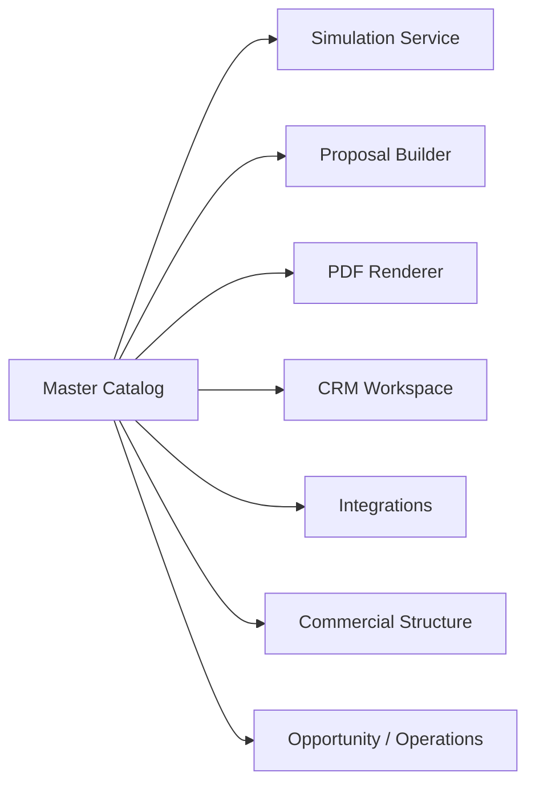

# SDC 2.7 - Master Catalog Canonicalization Blueprint

Status: Draft arquitetural
Date: 2026-07-09
Owner: Enterprise Architecture / Principal Engineering
Scope: FINQZ PRO Enterprise - Master Catalog, Product Taxonomy, Commercial Structure, Simulation, Proposal, PDF, CRM and Integrations

---

## 1. Objetivo

Definir a arquitetura definitiva do Master Catalog do FINQZ PRO Enterprise como referencia canonica para:

- Produtos Financeiros
- Subprodutos
- Categorias Comerciais
- Estrutura Comercial
- Simulation Engine
- Proposal
- PDF
- CRM
- Integracoes
- Providers
- Comercializadoras
- Bancos
- Corbans

Esta fase nao implementa runtime. O objetivo e registrar a forma canonica, o ownership, os contratos, os consumidores e a estrategia de migracao para a FASE 3.

---

## 2. Escopo

### 2.1 Documentacao analisada

- `docs/00-master/DCA-FINQZ-PRO-ENTERPRISE-v2.md`
- `docs/01-architecture/SDC-FASE-1-SDA-01-SIMULATION-DOMAIN-AUDIT.md`
- `docs/01-architecture/SDC-FASE-2-SSOT-01-SINGLE-SOURCE-OF-TRUTH.md`
- `docs/01-architecture/SDC-FASE-2.6-PRODUCT-SUBPRODUCT-TAXONOMY-AUDIT.md`
- `docs/02-architecture/ARCH-016-OPPORTUNITY-WORKSPACE-BLUEPRINT.md`
- `docs/02-architecture/DCA-vNEXT-FINQZ-PRO-ENTERPRISE.md`
- `docs/09-product/EPC-PRODUCT-01-PRODUCT-READINESS-AUDIT.md`
- `docs/09-product/EPC-PRODUCT-02-END-TO-END-BUSINESS-SCENARIOS.md`
- `docs/08-governance/README.md`

### 2.2 Codigo analisado

- `backend/src/modules/master-catalog/**`
- `backend/src/modules/simulation/**`
- `backend/src/modules/commercial/**`
- `backend/src/modules/opportunities/**`
- `src/data/catalogRepository.ts`
- `src/data/creditPfCatalog.ts`
- `src/data/commercialRepository.ts`
- `src/pages/Oportunidades.tsx`
- `src/pages/Simulador.tsx`

---

## 3. Situacao atual

### 3.1 O que ja e canonico hoje

- O backend possui um dominio formal de Master Catalog com contrato, seed, read model, validator, repository, service e surface HTTP.
- O frontend possui um catalogo PF mais rico em `creditPfCatalog.ts`.
- `commercialRepository.ts` e `catalogRepository.ts` operam como camadas de compatibilidade e adaptacao local.
- `Oportunidades.tsx` e `Simulador.tsx` consomem essa taxonomia para montar a experiencia comercial.

### 3.2 O que ainda esta divergente

- O backend master catalog ainda nao representa toda a taxonomia do frontend.
- `Empréstimo com Garantia`, `Auto Equity` e `Home Equity` existem no frontend, mas nao estao formalizados no seed canonico do backend.
- `Antecipação` vs `Antecipação FGTS`, `Energia` vs `Energia por Assinatura`, `Seguros` vs `Seguro` revelam divergencias de naming.
- A camada comercial ainda traduz e redistribui catalogos, o que indica coexistencia de fontes.

### 3.3 Conclusao da situacao atual

O Master Catalog e a direcao correta para a canonicidade, mas ainda opera em regime de consolidacao parcial. O frontend ainda possui taxa de verdade operacional maior para produtos PF do que o backend master catalog.

---

## 4. Problemas encontrados

1. Taxonomia PF bifurcada entre frontend e backend.
2. Catálogo mestre backend com escopo menor do que o catálogo comercial real do produto.
3. Nomenclatura divergente entre camadas.
4. Compatibility layers ainda participam da experiencia oficial.
5. Proposal e PDF dependem de payload final, mas podem ser afetados por origens paralelas de catalogo.
6. A ausencia de uma hierarquia canônica unica dificulta FASE 3.

---

## 5. Visao canonica

### 5.1 Posicionamento arquitetural

O Master Catalog deve ser a fonte canônica para:

- identidade de produto;
- identidade de subproduto;
- classificacao comercial;
- classificacao operacional;
- vinculo com providers e canais;
- estrutura de consumo por Simulation, Proposal, PDF e CRM.

### 5.2 Principio chave

O Master Catalog define o que o produto e. Os demais dominios definem o que fazer com ele.

### 5.3 Regra de arquitetura

- Master Catalog nao calcula simulacao.
- Master Catalog nao monta PDF.
- Master Catalog nao decide proposta.
- Master Catalog nao persiste resultado operacional de negocio.
- Master Catalog publica contratos e taxonomia.

---

## 6. Modelo conceitual

### 6.1 Entidades canonicas

- `Produto`
- `Subproduto`
- `Categoria Comercial`
- `Categoria Operacional`
- `Linha Financeira`
- `Provider`
- `Comercializadora`
- `Banco`
- `Corban`
- `Canal Comercial`

### 6.2 Regras conceituais

- `Produto` agrupa uma linha comercial principal.
- `Subproduto` especializa o produto principal.
- `Categoria Comercial` organiza a oferta por mercado e go-to-market.
- `Categoria Operacional` organiza o fluxo interno e a execucao.
- `Linha Financeira` identifica a natureza economica do produto.
- `Provider` representa a fonte externa ou parceira com capacidade operacional.
- `Comercializadora`, `Banco` e `Corban` sao classificacoes de provider.
- `Canal Comercial` identifica o caminho de entrada ou distribuicao.

---

## 7. Produto

### 7.1 Modelo canonico recomendado

Cada Produto deve possuir:

- ID
- Codigo
- Nome
- Slug
- Status
- Categoria
- Tipo
- Ordem
- Icone
- Cor
- Descricao
- Owner
- Versionamento
- Data de criacao
- Data de alteracao
- Origem
- Compatibilidade
- Ativo

### 7.2 Produtos canonicos recomendados

| Produto | Codigo canonico | Status da recomendacao |
| --- | --- | --- |
| Empréstimo com Garantia | `EMPRESTIMO_COM_GARANTIA` | Canonical |
| Consignado | `CONSIGNADO` | Canonical |
| Crédito Pessoal CDC | `CREDITO_PESSOAL_CDC` | Canonical |
| Financiamento | `FINANCIAMENTO` | Canonical |
| Antecipação | `ANTECIPACAO` | Canonical com harmonizacao para FGTS |
| Energia | `ENERGIA` | Canonical com harmonizacao para Energia por Assinatura |
| Seguros | `SEGURO` | Canonical com harmonizacao de naming |
| Consórcio | `CONSORCIO` | Canonical |
| Cartão | `CARTAO` | Canonical |

### 7.3 Observacao de ownership

O produto canonico deve ser publicado e mantido no Master Catalog backend, com frontend apenas consumindo a versao ativa.

---

## 8. Subproduto

### 8.1 Modelo canonico recomendado

Cada Subproduto deve possuir:

- ID
- Produto Pai
- Codigo
- Nome
- Slug
- Categoria
- Simulation Engine
- Proposal
- Provider
- Workflow
- Status

### 8.2 Subprodutos canonicos recomendados por produto

#### Empréstimo com Garantia

- Home Equity
- Auto Equity

#### Consignado

- INSS
- Federal
- Estadual
- Municipal
- CLT
- Forças Armadas
- Cartão RMC
- Cartão Benefício

#### Crédito Pessoal CDC

- Clean
- Avalista
- Digital

#### Financiamento

- Veículos
- Imobiliário
- Construção

#### Antecipação

- FGTS
- Salario
- Beneficios

#### Energia

- Geracao Distribuida
- Mercado Livre

#### Seguros

- Prestamista
- Vida
- Protecao Financeira

#### Consórcio

- Imobiliario
- Veiculos
- Servicos

#### Cartão

- Credito Rotativo
- Parcelamento de Fatura
- Parcelado Loja

---

## 9. Categoria Comercial

### 9.1 Definicao

Categoria Comercial e a camada que organiza a oferta por proposta de mercado, canal e posicao na esteira comercial.

### 9.2 Papel no modelo canonico

- agrupar produtos para visao de negocio;
- apoiar selecao de jornada e pipeline;
- permitir filtros e agrupamentos sem alterar o produto canonico.

### 9.3 Relacao com o que existe hoje

- `commercialRepository.ts` hoje representa parte dessa estrutura no frontend.
- `backend/src/modules/commercial` valida tabelas e condicoes comerciais.
- O Master Catalog deve ser a referencia de classificacao, enquanto Commercial Table deve conter as condicoes.

---

## 10. Provider

### 10.1 Definicao

Provider e a entidade externa ou parceira que executa, habilita ou suporta uma oferta.

### 10.2 Classificacoes canonicas

- Banco
- Comercializadora
- Corban
- Fintech
- Seguradora
- Hub

### 10.3 Observacao de ownership

O Master Catalog deve manter a classificacao canonica do provider no nivel de oferta e associacao comercial.
O dominio de Integrations deve manter a saude, conectividade, credenciais, runtime e diagnostico do provider.

### 10.4 Situacao atual

- `src/data/commercialRepository.ts` possui providers de banco e energia.
- `backend/src/modules/integrations/application/provider-catalog.ts` possui providers de integracao.
- Essas listas sao complementares, mas ainda nao sao uma unica fonte.

---

## 11. Comercializadora

### 11.1 Definicao

Comercializadora e o provider de energia ou canal correlato que distribui a oferta de energia.

### 11.2 Papel canonico

- classificar players de energia;
- vincular a produtos e subprodutos de energia;
- permitir consumo por `commercialRepository` e `Master Catalog`.

### 11.3 Estado atual

`commercialRepository.ts` ja distingue `ENERGY_PROVIDER`, mas isso ainda e uma classificacao de compatibilidade e nao o contrato canonico final.

---

## 12. Banco

### 12.1 Definicao

Banco e o provider financeiro com capacidade de funding, emissao ou captura de oferta.

### 12.2 Papel canonico

- classificar providers financeiros;
- relacionar produtos financeiros a bancos participantes;
- suportar simulate -> proposal -> operation.

### 12.3 Estado atual

`commercialRepository.ts` traz varios bancos como providers de apoio, mas o Master Catalog deve ser o ponto canonico para relacao produto/banco.

---

## 13. Corban

### 13.1 Definicao

Corban e o canal comercial/parceiro que distribui produtos financeiros sob contrato.

### 13.2 Papel canonico

- classificar canal comercial;
- relacionar oportunidade, pipeline e produto;
- suportar regras de distribuicao e elegibilidade.

### 13.3 Estado atual

O dominio de partner/acquisition e pipeline ja trata canais e fluxos, mas o Master Catalog deve referenciar a dimensao comercial do corban.

---

## 14. Ownership

### 14.1 Resposta objetiva

#### Quem e dono do Master Catalog?

- **Dono canonico recomendado:** Backend Master Catalog.
- **Evidencia atual:** `backend/src/modules/master-catalog/**` ja define contrato, seed, read model, repository, service e API.

#### Quem pode escrever?

- Backend Master Catalog, via service/repository/validator e rotas administrativas.
- Frontend nao escreve o catalogo canônico em runtime.

#### Quem pode ler?

- Frontend (`Oportunidades`, `Simulador`, `commercialRepository`, adapters de estrutura comercial).
- Simulation Engine.
- Proposal/PDF.
- Commercial domain.
- Integrations e operation, quando precisarem classificar uma oferta.

#### Quem versiona?

- O backend Master Catalog.
- O versionamento deve estar no contrato de entidade e no ciclo de publish.

#### Quem distribui?

- O backend Master Catalog, via API/contract.
- A distribuicao para frontend e consumidores deve acontecer por leitura de contrato e nao por duplicacao local.

#### Quem publica?

- O backend Master Catalog.
- A publicacao deve expor versao ativa/status `ACTIVE`.

#### Quem consome?

- Workspace
- Simulador
- Commercial Structure
- Proposal
- PDF
- CRM
- Integrations
- Operations

#### Quem sincroniza frontend/backend?

- O backend Master Catalog como fonte principal.
- Frontend apenas reflete a versao publicada.
- Camadas de compatibilidade podem traduzir durante a migracao, mas nao podem virar nova fonte de verdade.

---

## 15. Versionamento

### 15.1 Modelo recomendado

- cada entidade possui `status` e `displayOrder`;
- o catalogo deve possuir versao semantica ou versionamento de publicacao;
- alteracoes devem ser auditaveis por tenant;
- produtos e subprodutos precisam suportar historico de compatibilidade.

### 15.2 Estado atual observado

O backend ja suporta:

- `status`
- `displayOrder`
- `tenantId`
- `createdAt`
- `updatedAt`

Referencia:

- `backend/src/modules/master-catalog/domain/master-catalog.contract.ts`
- `backend/src/modules/master-catalog/validators/master-catalog.validator.ts`
- `backend/src/modules/master-catalog/presentation/http/master-catalog.http.contract.ts`

### 15.3 Lacuna atual

Ainda nao existe um fluxo de publish/versionamento explicitamente completo para cobrir toda a taxonomia PF do frontend.

---

## 16. Fluxo de consumo

### 16.1 Fluxo canônico recomendado

### 16.2 Regra de consumo

- Simulacao consome o catalogo para saber o que pode ser calculado.
- Proposal consome o resultado da simulacao e a taxonomia canonica.
- PDF consome o payload final e nunca recalcula.
- CRM e Opportunity usam o catalogo para guiar a experiencia comercial.
- Integrations usam o catalogo para classificar e conectar providers.

---

## 17. Contratos

### 17.1 Contratos canonicos esperados

- `Product`
- `Subproduct`
- `Simulation Engine`
- `Proposal`
- `Provider`
- `Commercial Structure`

### 17.2 Contratos existentes hoje

- `backend/src/modules/master-catalog/domain/master-catalog.contract.ts`
- `backend/src/modules/master-catalog/domain/master-catalog.read-model.ts`
- `backend/src/modules/master-catalog/domain/master-catalog-repository.contract.ts`
- `backend/src/modules/master-catalog/services/master-catalog.service.contract.ts`
- `backend/src/modules/master-catalog/presentation/http/master-catalog.http.contract.ts`

### 17.3 Contratos de consumo adjacentes

- `backend/src/modules/simulation/domain/contracts/simulation.contract.ts`
- `backend/src/modules/integrations/domain/contracts/integration-proposal.contract.ts`
- `backend/src/modules/integrations/domain/contracts/financial-proposal/financial-proposal.contract.ts`
- `backend/src/modules/operation/contracts/operation.contracts.ts`
- `backend/src/modules/commercial/validators/commercial.validator.ts`

---

## 18. Compatibilidade

### 18.1 Camadas de compatibilidade existentes

- `src/data/creditPfCatalog.ts`
- `src/data/commercialRepository.ts`
- `src/data/catalogRepository.ts`
- `src/config/pipelines.ts`
- `src/features/master-catalog/loadEstruturaComercialFromMasterCatalog.ts`
- `src/features/master-catalog/masterCatalogToEstruturaComercial.mapper.ts`

### 18.2 Regra de uso

- compatibilidade pode ler e traduzir;
- compatibilidade nao pode definir canonicidade;
- compatibilidade nao pode sobrescrever o Master Catalog;
- compatibilidade deve ser removida somente apos o substituto ficar validado.

### 18.3 Classificacao

- `creditPfCatalog.ts`: compatibility layer rica para produtos PF
- `commercialRepository.ts`: compatibility layer para UI comercial e simulador
- `catalogRepository.ts`: compatibility layer local para catalogo e eventos
- `config/pipelines.ts`: compatibility layer de pipeline legado

---

## 19. Estrategia de migracao

### 19.1 Direcao recomendada

1. Consolidar a taxonomia completa no backend Master Catalog.
2. Publicar a mesma taxonomia para frontend e consumidores.
3. Reclassificar `creditPfCatalog`, `commercialRepository` e `catalogRepository` como adaptadores de compatibilidade temporarios.
4. Atualizar Simulation, Opportunity, Proposal e PDF para ler apenas o contrato canonico.
5. Remover fallbacks divergentes somente apos validacao por contract tests.

### 19.2 Passos de migracao

- Harmonizar naming entre frontend e backend.
- Expandir o backend para suportar `Empréstimo com Garantia`, `Auto Equity` e `Home Equity`.
- Formalizar a classificacao de `Antecipação`, `Energia` e `Seguros`.
- Publicar um contrato de catalogo unico.
- Encerrar gradualmente a dependência de adapters locais.

---

## 20. Plano para FASE 3

### 20.1 Foco da FASE 3

- Fonte unica de verdade para catalogo e oferta.
- Simulation Engine consumindo apenas a taxonomia canonica.
- Proposal e PDF completamente desacoplados de catalogos locais.
- CRM e Opportunity consumindo o mesmo contrato canonico.

### 20.2 Entregaveis esperados

- catalogo mestre completo;
- contratos unificados;
- adapters reduzidos a compatibilidade;
- validacao de produto/subproduto por tenant;
- matrix de publicacao e versionamento.

---

## 21. Critério de encerramento

A FASE 2.7 so pode ser encerrada quando:

1. o Master Catalog backend representar toda a taxonomia canônica;
2. `Empréstimo com Garantia`, `Auto Equity` e `Home Equity` estiverem formalizados no catalogo mestre;
3. frontend e backend consumirem a mesma arvore canonica;
4. Proposal e PDF nao dependerem de taxonomia local;
5. `commercialRepository`, `creditPfCatalog` e `catalogRepository` estiverem claramente classificados como compatibilidade ou migrados;
6. existir matriz completa de produtos, subprodutos, providers e workflows;
7. nao houver ambiguidade de ownership entre Product, Provider e Commercial Structure.

---

## 22. Status final

Status: `AUDIT COMPLETED - GO WITH RESTRICTIONS`

### Justificativa

- a arquitetura canônica foi definida;
- o backend Master Catalog e o owner recomendado;
- o runtime atual ainda e parcialmente bifurcado entre frontend e backend;
- a migracao para uma fonte unica exige harmonizacao de taxonomia antes de liberar a FASE 3.

---

## Anexo A - Hierarquia canonica recomendada

```mermaid
flowchart TD
  A[Produtos Financeiros]
  A --> B[Empréstimo com Garantia]
  B --> B1[Auto Equity]
  B --> B2[Home Equity]
  A --> C[Consignado]
  C --> C1[INSS]
  C --> C2[Federal]
  C --> C3[Estadual]
  C --> C4[Municipal]
  C --> C5[CLT]
  C --> C6[Forças Armadas]
  C --> C7[Cartão RMC]
  C --> C8[Cartão Benefício]
  A --> D[Crédito Pessoal CDC]
  D --> D1[Clean]
  D --> D2[Avalista]
  D --> D3[Digital]
  A --> E[Financiamento]
  E --> E1[Veículos]
  E --> E2[Imobiliário]
  E --> E3[Construção]
  A --> F[Antecipação]
  F --> F1[FGTS]
  F --> F2[Salario]
  F --> F3[Beneficios]
  A --> G[Energia]
  G --> G1[Geração Distribuida]
  G --> G2[Mercado Livre]
  A --> H[Seguros]
  H --> H1[Prestamista]
  H --> H2[Vida]
  H --> H3[Protecao Financeira]
  A --> I[Consórcio]
  I --> I1[Imobiliario]
  I --> I2[Veiculos]
  I --> I3[Servicos]
```

## Anexo B - Matriz resumida de produtos x subprodutos

| Produto | Subprodutos canonicos |
| --- | --- |
| Empréstimo com Garantia | Auto Equity, Home Equity |
| Consignado | INSS, Federal, Estadual, Municipal, CLT, Forças Armadas, Cartão RMC, Cartão Benefício |
| Crédito Pessoal CDC | Clean, Avalista, Digital |
| Financiamento | Veículos, Imobiliário, Construção |
| Antecipação | FGTS, Salario, Beneficios |
| Energia | Geração Distribuida, Mercado Livre |
| Seguros | Prestamista, Vida, Protecao Financeira |
| Consórcio | Imobiliario, Veiculos, Servicos |
| Cartão | Credito Rotativo, Parcelamento de Fatura, Parcelado Loja |

