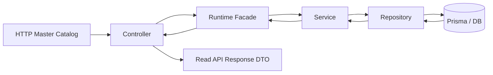

# SDC FASE 3.1 - Master Catalog Runtime

Status: Draft arquitetural / implementação controlada
Date: 2026-07-09
Owner: Enterprise Architecture / Principal Engineering
Scope: FINQZ PRO Enterprise - Master Catalog Runtime, Read APIs, DTOs, Compatibility

---

## 1. Objetivo

Implementar e formalizar o Master Catalog como runtime oficial de leitura para o ecossistema FINQZ PRO Enterprise, sem alterar regras financeiras, Simulation Engine, Proposal, PDF ou comportamento operacional existente.

O foco desta fase e disponibilizar uma superficie canonica de leitura para:

- Produto
- Subproduto
- Categoria Comercial
- Categoria Operacional
- Linha Financeira
- Provider
- Banco
- Corban
- Canal Comercial

---

## 2. Arquitetura

### 2.1 Componentes principais

- `backend/src/modules/master-catalog/domain/master-catalog.contract.ts`
- `backend/src/modules/master-catalog/domain/master-catalog.read-model.ts`
- `backend/src/modules/master-catalog/domain/master-catalog.mapper.ts`
- `backend/src/modules/master-catalog/domain/master-catalog.seed.ts`
- `backend/src/modules/master-catalog/domain/master-catalog-repository.contract.ts`
- `backend/src/modules/master-catalog/services/master-catalog.service.contract.ts`
- `backend/src/modules/master-catalog/services/master-catalog.service.ts`
- `backend/src/modules/master-catalog/repositories/master-catalog.prisma.repository.ts`
- `backend/src/modules/master-catalog/dto/master-catalog.dto.ts`
- `backend/src/modules/master-catalog/application/master-catalog.runtime.ts`
- `backend/src/modules/master-catalog/presentation/http/master-catalog.controller.ts`
- `backend/src/modules/master-catalog/presentation/http/master-catalog.routes.ts`
- `backend/src/modules/master-catalog/presentation/http/master-catalog.http.contract.ts`
- `backend/src/modules/master-catalog/validators/master-catalog.validator.ts`
- `backend/src/modules/master-catalog/validators/master-catalog.http.schema.ts`

### 2.2 Principio arquitetural

O backend Master Catalog e o owner canonico de leitura da taxonomia. O frontend consome a superficie publicada, mas nao define a verdade canonica.

---

## 3. Fluxo Runtime

### 3.1 Fluxo principal

### 3.2 Regras de runtime

- toda leitura exige tenant context;
- a API publica somente endpoints de leitura;
- o runtime nao executa regras financeiras;
- o runtime nao publica Proposal ou PDF;
- o runtime nao substitui os catálogos locais nesta fase;
- o runtime opera em paralelo durante a migracao.

### 3.3 Endpoints oficiais

- `GET /api/v1/master-catalog/tree`
- `GET /api/v1/master-catalog/segments`
- `GET /api/v1/master-catalog/products`
- `GET /api/v1/master-catalog/products/:productId/subproducts`
- `GET /api/v1/master-catalog/subproducts/:subproductId/modalities`

Referencia:

- `backend/src/modules/master-catalog/presentation/http/master-catalog.routes.ts`
- `backend/src/modules/master-catalog/presentation/http/master-catalog.http.contract.ts`

---

## 4. DTOs

### 4.1 DTOs oficiais

O runtime expõe DTOs formais em:

- `backend/src/modules/master-catalog/dto/master-catalog.dto.ts`

DTOs principais:

- `CatalogSegmentDto`
- `CatalogProductDto`
- `CatalogSubproductDto`
- `CatalogModalityDto`
- `MasterCatalogTreeDto`

### 4.2 Metadados de runtime

O DTO de runtime inclui metadados canonicos:

- `version`
- `compatibilityMode`
- `source`

Isso permite evolucao controlada sem alterar a forma de resposta dos dados.

### 4.3 Compatibilidade

Os DTOs sao derivados dos read models e preservam a forma de resposta atual. A camada de DTO existe para explicitar ownership e separar dominio interno da superficie publicada.

---

## 5. Contracts

### 5.1 Contratos de dominio

- `CatalogSegment`
- `CatalogProduct`
- `CatalogSubproduct`
- `CatalogModality`
- `MasterCatalogTreeReadModel`

### 5.2 Contratos de repositorio

- `MasterCatalogRepository`

### 5.3 Contratos de servico

- `MasterCatalogServiceContract`

### 5.4 Contratos HTTP

- `MasterCatalogHttpRouteContract`
- `MasterCatalogHttpPermissionMap`
- `MasterCatalogHttpErrorContract`

### 5.5 Contrato de runtime

- `MasterCatalogRuntimeContract`

---

## 6. Repository

### 6.1 Papel

O repository e a camada de persistencia oficial para leitura do Master Catalog.

### 6.2 Implementacao atual

Arquivo:

- `backend/src/modules/master-catalog/repositories/master-catalog.prisma.repository.ts`

Responsabilidades:

- listar segmentos;
- listar produtos;
- listar subprodutos por produto;
- listar modalities por subproduto;
- recuperar a tree completa;
- encontrar registros por code;
- aplicar tenant filter;
- aplicar filtro de status;
- normalizar e ordenar a arvore publicada.

### 6.3 Regras

- read only;
- tenant scoped;
- status aware;
- order by displayOrder + name;
- sem qualquer calculo financeiro.

---

## 7. Services

### 7.1 Service canonico

Arquivo:

- `backend/src/modules/master-catalog/services/master-catalog.service.ts`

### 7.2 Responsabilidades

- validar tenant context;
- delegar para repository;
- preservar contrato de leitura;
- manter o runtime livre de regra de negocio financeira.

### 7.3 Observacao arquitetural

O service permanece como fronteira interna do dominio. A camada `runtime` expõe a superficie publicada para consumidores e controllers.

---

## 8. Read Models

### 8.1 Finalidade

Os read models representam a forma de leitura interna do dominio antes da publicacao do DTO.

### 8.2 Arquivo

- `backend/src/modules/master-catalog/domain/master-catalog.read-model.ts`

### 8.3 Estrutura

- `CatalogSegmentReadModel`
- `CatalogProductReadModel`
- `CatalogSubproductReadModel`
- `CatalogModalityReadModel`
- `MasterCatalogTreeReadModel`

### 8.4 Regra

Read models nao devem conter tenantId, persisted business rules ou calculos financeiros.

---

## 9. Compatibilidade

### 9.1 Compatibilidade obrigatoria

Os catálogos locais continuam funcionando durante a migracao:

- `src/data/catalogRepository.ts`
- `src/data/creditPfCatalog.ts`
- `src/data/commercialRepository.ts`

### 9.2 Estratégia atual

- o backend Master Catalog passa a ser a superficie canonica de leitura;
- o frontend continua com catálogos locais apenas como compatibilidade;
- adapters podem traduzir entre runtime canonico e consumers antigos sem alterar comportamento.

### 9.3 Regras de compatibilidade

- nao quebrar consumidores existentes;
- nao remover compatibilidade antes da validacao;
- nao criar fluxos paralelos de escrita;
- nao reintroduzir fonte local como origem canonica.

### 9.4 Estado atual

A fase 3.1 formaliza o runtime oficial sem desligar a compatibilidade. A migracao da leitura deve ser gradual e coberta por testes.

---

## 10. Plano de migracao

### 10.1 Curto prazo

1. Consolidar o runtime oficial e os DTOs.
2. Manter as rotas atuais de leitura.
3. Publicar a superficie de leitura para consumidores internos.
4. Cobrir repository, service, runtime, DTOs e HTTP com testes.

### 10.2 Medio prazo

1. Expandir a taxonomia do backend para cobrir a profundidade do frontend.
2. Introduzir adaptadores de leitura onde houver divergencia.
3. Reduzir dependencias diretas de catálogos locais no frontend.

### 10.3 Longo prazo

1. Centralizar o consumo da taxonomia no Master Catalog backend.
2. Desativar compatibilidade legada apenas apos substitutos validados.

---

## 11. Critério de saída

A FASE 3.1 so pode ser encerrada quando:

1. a API oficial de leitura do Master Catalog estiver publicada e coberta por testes;
2. o runtime estiver operando sem alterar comportamento existente;
3. DTOs, contracts, repository, service e HTTP estiverem documentados;
4. a compatibilidade com `catalogRepository`, `creditPfCatalog` e `commercialRepository` permanecer intacta;
5. o frontend puder consumir a leitura canonica sem ruptura;
6. build e testes do frontend e backend estiverem verdes.

---

## 12. Status final

Status: `IMPLEMENTATION CONTROLLED - IN PROGRESS`

### Veredito esperado ao final da Fase

`GO WITH RESTRICTIONS`

Motivo:

- o runtime canonico de leitura passa a existir;
- a compatibilidade permanece ativa;
- a taxonomia completa ainda requer harmonizacao entre frontend e backend em fases posteriores.
