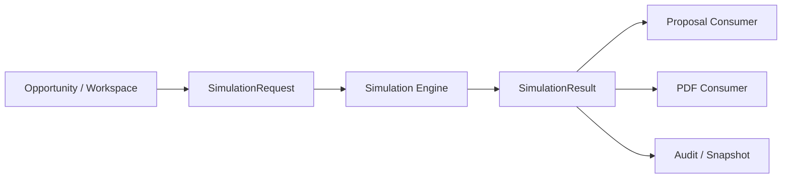
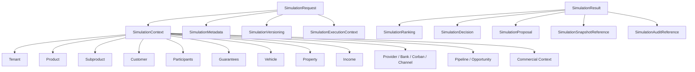
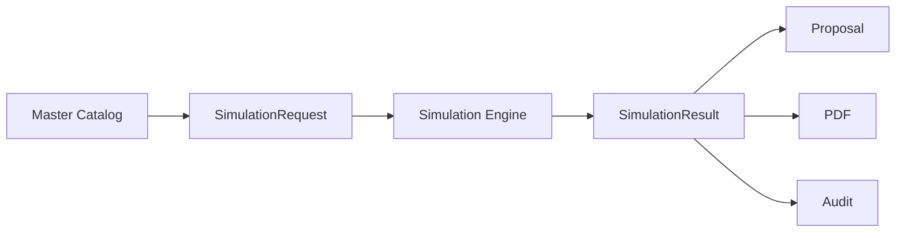

# SDC FASE 3.2 - Simulation Engine Contracts

Status: Draft arquitetural / implementação controlada
Date: 2026-07-09
Owner: Enterprise Architecture / Principal Engineering
Scope: FINQZ PRO Enterprise - Simulation Engine Contract Layer

---

## 1. Objetivo

Definir e implementar a camada contratual oficial do Simulation Engine Enterprise para padronizar entrada, saída, auditoria, versionamento e compatibilidade de qualquer simulação financeira do FINQZ PRO.

Esta fase nao migra regras financeiras, nao altera calculos existentes, nao modifica Proposal ou PDF e nao altera APIs publicas existentes.

O objetivo e criar a infraestrutura contratual que permita a migracao gradual de todos os produtos financeiros.

---

## 2. Escopo

### 2.1 Codigo analisado

- `backend/src/modules/simulation/**`
- `backend/src/modules/master-catalog/**`
- `backend/src/modules/opportunities/**`
- `backend/src/modules/integrations/**`
- `backend/src/modules/commercial/**`
- `src/pages/Oportunidades.tsx`
- `src/pages/Simulador.tsx`

### 2.2 Documentacao analisada

- `docs/01-architecture/SDC-FASE-1-SDA-01-SIMULATION-DOMAIN-AUDIT.md`
- `docs/01-architecture/SDC-FASE-2-SSOT-01-SINGLE-SOURCE-OF-TRUTH.md`
- `docs/01-architecture/SDC-FASE-2.6-PRODUCT-SUBPRODUCT-TAXONOMY-AUDIT.md`
- `docs/01-architecture/SDC-FASE-2.7-MASTER-CATALOG-CANONICALIZATION-BLUEPRINT.md`
- `docs/01-architecture/SDC-FASE-3.1-MASTER-CATALOG-RUNTIME.md`
- `docs/02-architecture/ARCH-016-OPPORTUNITY-WORKSPACE-BLUEPRINT.md`
- `docs/00-master/DCA-FINQZ-PRO-ENTERPRISE-v2.md`

### 2.3 Nota de escopo

O diretório `backend/src/modules/edp` nao foi encontrado no snapshot atual do repositório. Nenhuma dependencia nova foi introduzida sobre esse caminho.

---

## 3. Princípios

1. Simulation Engine nunca conhece telas.
2. Simulation Engine nunca conhece React.
3. Simulation Engine nunca conhece Proposal.
4. Simulation Engine nunca conhece PDF.
5. Simulation Engine apenas recebe contratos.
6. Simulation Engine apenas devolve contratos.
7. Nenhum calculo financeiro foi migrado nesta fase.
8. Nenhuma API publica existente foi alterada.
9. A compatibilidade com contratos legados permanece ativa.
10. Um contrato canonico deve servir todos os produtos, com campos opcionais onde o dominio exigir.

---

## 4. Contrato de Entrada

### 4.1 Arquivo oficial

- `backend/src/modules/simulation/contracts/simulation.contract.ts`

### 4.2 Contract principal

`SimulationRequest` e o contrato oficial de entrada do motor de simulacao.

### 4.3 Estrutura conceitual

O request contempla, no minimo:

- tenant
- produto
- subproduto
- cliente
- participantes
- garantias
- veiculo
- imovel
- renda
- convenio
- provider
- comercializadora
- banco
- corban
- canal
- pipeline
- oportunidade
- configuracao comercial
- parametros
- metadados
- versionamento

### 4.4 Estrutura implementada

O request foi organizado em blocos canonicos:

- `SimulationTenantContext`
- `SimulationProductContext`
- `SimulationSubproductContext`
- `SimulationParticipant`
- `SimulationCollateral`
- `SimulationAsset`
- `SimulationIncomeContext`
- `SimulationAgreementContext`
- `SimulationProviderContext`
- `SimulationChannelContext`
- `SimulationPipelineContext`
- `SimulationOpportunityContext`
- `SimulationCommercialContext`
- `SimulationParameters`
- `SimulationMetadata`
- `SimulationVersioning`
- `SimulationExecutionContext`

### 4.5 Observacao arquitetural

O request esta pronto para acomodar:

- `Empréstimo com Garantia`
- `Home Equity`
- `Auto Equity`
- `Consignado`
- `FGTS`
- `Energia`
- `CDC`
- `Financiamento`
- `Consórcio`
- `Seguros`

O contrato e suficientemente generico para todos eles porque a especializacao acontece nos blocos opcionais.

---

## 5. Contrato de Saída

### 5.1 Arquivo oficial

- `backend/src/modules/simulation/contracts/simulation.contract.ts`

### 5.2 Contract principal

`SimulationResult` e o contrato oficial de saida do motor de simulacao.

### 5.3 Campos obrigatorios de saida

O result contempla:

- produto
- subproduto
- resultado
- propostas
- ranking
- provider escolhido
- motivos de rejeicao
- alertas
- warnings
- snapshot
- proposalReference
- auditReference
- engineVersion
- catalogVersion
- policyVersion
- strategyVersion
- executionId
- executionTimestamp

### 5.4 Estrutura implementada

O result foi modelado com:

- `SimulationResultItem`
- `SimulationProposal`
- `SimulationRanking`
- `SimulationDecision`
- `SimulationSnapshotReference`
- `SimulationProposalReference`
- `SimulationAuditReference`
- `SimulationResultStatus`

### 5.5 Regra de uso

O result e apenas um envelope de resposta. Ele nao calcula Proposal, nao calcula PDF e nao conhece tela.

---

## 6. Value Objects

### 6.1 Arquivos oficiais

- `backend/src/modules/simulation/value-objects/simulation-version.value-object.ts`
- `backend/src/modules/simulation/value-objects/simulation-snapshot-reference.value-object.ts`

### 6.2 Objetos definidos

- `SimulationVersionValueObject`
- `SimulationSnapshotReferenceValueObject`

### 6.3 Funcoes de fabrica

- `createSimulationVersion`
- `createSimulationSnapshotReference`

### 6.4 Papel arquitetural

Os value objects servem para:

- normalizar string values;
- preservar imutabilidade;
- facilitar compatibilidade futura;
- reduzir acoplamento entre contrato e runtime.

---

## 7. DTOs

### 7.1 Arquivo oficial

- `backend/src/modules/simulation/dto/simulation.dto.ts`

### 7.2 DTOs definidos

- `SimulationRequestDto`
- `SimulationResultDto`
- `SimulationMetadataDto`
- `SimulationParticipantDto`
- `SimulationProposalDto`
- `SimulationRankingDto`
- `SimulationDecisionDto`
- `SimulationExecutionContextDto`
- `SimulationSnapshotReferenceDto`
- `SimulationProposalReferenceDto`
- `SimulationAuditReferenceDto`
- `SimulationAuditDto`

### 7.3 Funcoes de conversao

- `toSimulationRequestDto`
- `toSimulationResultDto`
- `toSimulationMetadataDto`
- `toSimulationExecutionContextDto`
- `toSimulationSnapshotReferenceDto`
- `toSimulationProposalReferenceDto`
- `toSimulationAuditReferenceDto`
- `toSimulationAuditDto`

### 7.4 Regra

Os DTOs sao clones imutaveis dos contratos, prontos para transporte, serializacao ou adaptacao futura.

---

## 8. Contrato de Auditoria

### 8.1 Arquivo oficial

- `backend/src/modules/simulation/contracts/simulation.contract.ts`

### 8.2 Estrutura

Cada execucao possui:

- `executionId`
- `correlationId`
- `catalogVersion`
- `engineVersion`
- `policyVersion`
- `strategyVersion`
- `requestHash`
- `snapshotReference`
- `auditReference`
- `recordedAt`

### 8.3 Papel

O contrato de auditoria garante rastreabilidade de:

- origem do request;
- versao do motor;
- versao do catalogo;
- snapshot usado;
- trilha de correlacao;
- reprodutibilidade da decisao.

---

## 9. Versionamento

### 9.1 Contratos de versionamento

- `SimulationMetadata`
- `SimulationVersioning`
- `SimulationExecutionContext`

### 9.2 Regra

O versionamento pertence ao contrato, nao ao renderer nem a Proposal/PDF.

### 9.3 Compatibilidade

A fase 3.2 nao altera os contratos antigos em `backend/src/modules/simulation/domain/contracts/simulation.contract.ts`. Ela adiciona uma nova camada canonica paralela.

---

## 10. Compatibilidade

### 10.1 Contrato legado existente

- `backend/src/modules/simulation/domain/contracts/simulation.contract.ts`
- `backend/src/modules/simulation/domain/contracts/simulation-strategy.contract.ts`

### 10.2 Regra de coexistencia

- nenhum produto foi removido da camada antiga;
- nenhum calculo foi migrado;
- a camada canonica nova pode coexistir com a antiga;
- adaptadores futuros devem ser introduzidos somente apos validacao dos contratos.

### 10.3 Efeito prático

O runtime atual continua funcionando como antes, enquanto a nova camada oficial passa a existir para migracao segura.

---

## 11. Fluxo de execução

### 11.1 Fluxo canonico

### 11.2 Fluxo por camadas

1. Workspace monta o request.
2. Master Catalog fornece a taxonomia canônica.
3. Simulation Engine recebe o contrato.
4. Engine devolve o resultado.
5. Proposal e PDF apenas consomem o envelope pronto.
6. Audit registra snapshot, hash e correlacao.

---

## 12. Diagrama

### 12.1 Hierarquia do contrato

### 12.2 Fluxo de runtime

---

## 13. Estratégia de migração

### 13.1 Fase atual

Fase 3.2 formaliza os contratos sem migrar calculos.

### 13.2 Proxima etapa

- criar adaptadores que convertam contratos legados para o novo envelope canonico;
- iniciar com `Empréstimo com Garantia -> Auto Equity / Home Equity`;
- depois cobrir `Consignado`, `FGTS`, `Energia`, `CDC`, `Financiamento`, `Consórcio` e `Seguros`.

### 13.3 Ordem recomendada

1. Contratos canonicos.
2. DTOs e value objects.
3. Validacao de compatibilidade.
4. Adaptadores.
5. Engine migration.

---

## 14. Critério de encerramento

A FASE 3.2 so pode ser encerrada quando:

1. todos os contratos canonicos forem definidos;
2. DTOs, value objects, factories e auditoria estiverem cobertos por testes;
3. a compatibilidade com o contrato legado for preservada;
4. os produtos listados validarem no mesmo envelope;
5. o frontend e o backend continuarem compilando e testando com sucesso;
6. nao houver alteracao de comportamento funcional nem de calculo financeiro.

---

## 15. Status final

Status: `IMPLEMENTATION CONTROLLED - IN PROGRESS`

### Veredito esperado

`GO WITH RESTRICTIONS`

### Motivo

- o contrato oficial do Simulation Engine foi formalizado;
- a compatibilidade foi preservada;
- o calculo financeiro permaneceu intocado;
- a migracao real do runtime ocorrerá apenas em fase posterior com adaptadores validados.

---

## Anexo A - Produtos validados contra o contrato

| Produto | Cabe no contrato atual? | Observação |
| --- | --- | --- |
| Auto Equity | Sim | Usa veículo como asset e collateral opcionalmente vinculado |
| Home Equity | Sim | Usa imóvel como asset e collateral opcionalmente vinculado |
| Consignado | Sim | Usa convênio, participantes e contexto comercial |
| FGTS | Sim | Usa agreement, provider e commercial context sem asset físico obrigatório |
| Energia | Sim | Usa provider/comercializadora e contexto comercial específico |
| CDC | Sim | Usa customer, income, bank e pipeline comercial |
| Financiamento | Sim | Usa asset de veículo/imóvel e collateral |
| Consórcio | Sim | Usa proposta/ranking e contexto comercial próprio |
| Seguros | Sim | Usa provider, customer e proposta sem colateral físico obrigatório |

### Conclusão do anexo

Todos os produtos cabem no contrato comum. As diferenças ficam concentradas nos blocos opcionais de contexto, provider e collateral.

