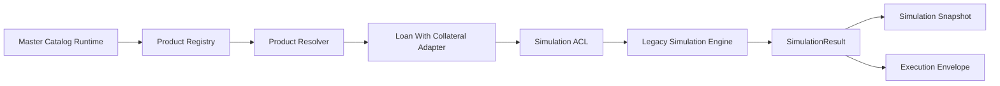

# SDC FASE 3.4B - Loan With Collateral Adapter

## 1. Objetivo
Implementar o primeiro Product Adapter funcional do Simulation Engine para o produto `Empréstimo com Garantia`, com suporte aos subprodutos `Auto Equity` e `Home Equity`, sem alterar regras financeiras, Workspace, Proposal, PDF, APIs públicas, banco ou compatibilidade legada.

## 2. Arquitetura
### Camadas entregues
- `backend/src/modules/simulation/products/base`
- `backend/src/modules/simulation/products/loan-with-collateral`

### Integracao usada
- Master Catalog Runtime
- Simulation Contracts
- Simulation Bridge
- Simulation ACL
- Simulation Snapshot
- Simulation Execution Envelope
- Legacy Simulation Engine

### Visao resumida

## 3. Fluxo
1. O registry registra o adapter oficial de `Empréstimo com Garantia`.
2. O resolver encontra o adapter por `productId` e `subproductId`.
3. O adapter normaliza a entrada com apoio do Master Catalog Runtime.
4. O adapter chama a ACL para manter compatibilidade de contrato.
5. O adapter delega o cálculo ao motor legado existente.
6. O resultado legado é convertido de volta para `SimulationResult`.
7. O adapter gera `SimulationSnapshot` e `SimulationExecutionEnvelope`.

## 4. Registry
### Implementacao
- `backend/src/modules/simulation/products/base/simulation-product.registry.ts`
- `backend/src/modules/simulation/products/index.ts`

### Regra
O registry resolve por chaves normalizadas de produto e subproduto, sem `switch/case`.

### Produto registrado
- `product-emprestimo-com-garantia`
- `EMPRESTIMO_COM_GARANTIA`
- `Empréstimo com Garantia`

### Subprodutos registrados
- `subproduct-auto-equity`
- `AUTO_EQUITY`
- `Auto Equity`
- `subproduct-home-equity`
- `HOME_EQUITY`
- `Home Equity`

## 5. Resolver
### Implementacao
- `backend/src/modules/simulation/products/base/simulation-product.resolver.ts`

### Regra
O resolver devolve o adapter correto com base em:
- `productId` ou `productCode`
- `subproductId` ou `subproductCode`

## 6. Adapter
### Implementacao
- `backend/src/modules/simulation/products/loan-with-collateral/loan-with-collateral.adapter.ts`

### Responsabilidades
- identificar o produto;
- verificar suporte ao produto/subproduto;
- normalizar a entrada;
- chamar a ACL;
- delegar ao motor legado;
- converter o retorno para `SimulationResult`;
- gerar snapshot;
- gerar execution envelope;
- retornar o resultado canônico.

### Limites
- nao calcula regra financeira;
- nao altera formulas;
- nao substitui motor legado;
- nao mexe em Proposal, PDF ou Workspace.

## 7. Subprodutos
### Auto Equity
- tratado como especializacao do produto `Empréstimo com Garantia`;
- nao existe adapter exclusivo nesta fase;
- a resolucao ocorre por metadados e identificacao do subproduto.

### Home Equity
- tratado como especializacao do mesmo produto;
- nao existe adapter exclusivo nesta fase;
- a resolucao ocorre por metadados e identificacao do subproduto.

## 8. Compatibilidade
- O legacy engine permanece ativo.
- A ACL continua sendo a fronteira oficial entre contrato canonico e legado.
- O adapter nao remove compatibilidade existente.
- O `SimulationRequest` e o `SimulationResult` canonicos permanecem preservados.

## 9. Integracao com ACL
### Arquivos usados
- `backend/src/modules/simulation/acl/simulation-request-to-legacy-simulation-input.mapper.ts`
- `backend/src/modules/simulation/acl/legacy-simulation-result-to-simulation-result.mapper.ts`

### Papel
- manter o fluxo canonico desacoplado do formato legado;
- permitir que o adapter converse com o motor atual sem acoplamento estrutural;
- preservar a compatibilidade durante a migração.

## 10. Integracao com Snapshot
### Arquivo usado
- `backend/src/modules/simulation/snapshots/simulation-snapshot.factory.ts`

### Papel
O adapter gera snapshot sem recalcular regra financeira, apenas empacotando request/result/contexto.

## 11. Integracao com Execution Envelope
### Arquivo usado
- `backend/src/modules/simulation/execution/simulation-execution-envelope.factory.ts`

### Papel
O envelope carrega:
- `executionId`
- `correlationId`
- `requestHash`
- `snapshotReference`
- `auditReference`
- versionamento operacional

## 12. Testes
### Cobertura criada
- registro do adapter;
- resolver correto;
- `supports()`;
- `normalize()`;
- integracao com ACL;
- criacao de Snapshot;
- criacao de ExecutionEnvelope;
- preservacao de `SimulationRequest`;
- preservacao de `SimulationResult`;
- compatibilidade com legado.

### Arquivo de teste
- `backend/src/tests/unit/simulation/simulation.product-adapter.test.ts`

## 13. Critério de Encerramento
A fase 3.4B e considerada concluida quando:
1. o adapter de `Empréstimo com Garantia` estiver registrado e resolvido;
2. `Auto Equity` e `Home Equity` forem suportados pelo mesmo adapter;
3. ACL, snapshot e execution envelope estiverem integrados;
4. os testes estiverem passando;
5. nao houver alteracao de comportamento financeiro;
6. frontend e backend compilarem com sucesso.

## 14. Status Final
**GO WITH RESTRICTIONS**

### Motivo
- a primeira implementacao funcional da arquitetura SDC foi concluida;
- o primeiro adapter oficial existe;
- a compatibilidade com o legado foi preservada;
- o trabalho ainda depende da migracao progressiva dos demais produtos em fases posteriores.

