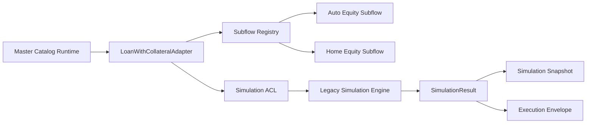

# SDC FASE 3.4C - Auto Equity & Home Equity Subflows

## 1. Objetivo
Consolidar `Auto Equity` e `Home Equity` como subfluxos internos formais do produto `Empréstimo com Garantia`, dentro do `LoanWithCollateralAdapter`, sem alterar regra financeira, Workspace, Proposal, PDF, APIs públicas, banco ou contratos de compatibilidade.

## 2. Contexto
Esta fase sucede a FASE 3.4B, que já entregou o primeiro adapter funcional de `Empréstimo com Garantia` com suporte aos subprodutos `Auto Equity` e `Home Equity`.

O foco da FASE 3.4C é explicitar a arquitetura interna desses subprodutos como subfluxos, mantendo o motor legado de cálculo como fonte operacional de simulação.

## 3. Arquitetura
### Camadas introduzidas
- `backend/src/modules/simulation/products/loan-with-collateral/subflows/loan-with-collateral.subflow.types.ts`
- `backend/src/modules/simulation/products/loan-with-collateral/subflows/loan-with-collateral.subflow.ts`
- `backend/src/modules/simulation/products/loan-with-collateral/subflows/auto-equity.subflow.ts`
- `backend/src/modules/simulation/products/loan-with-collateral/subflows/home-equity.subflow.ts`
- `backend/src/modules/simulation/products/loan-with-collateral/subflows/index.ts`

### Visao resumida

## 4. Subfluxos
### Auto Equity
- Produto canônico: `Empréstimo com Garantia`
- Subproduto canônico: `Auto Equity`
- Colateral estrutural esperado: `vehicle`
- Finalidade: reconhecer, validar e preparar contexto para o adapter principal

### Home Equity
- Produto canônico: `Empréstimo com Garantia`
- Subproduto canônico: `Home Equity`
- Colateral estrutural esperado: `property`
- Finalidade: reconhecer, validar e preparar contexto para o adapter principal

## 5. Capabilities
### Auto Equity
Capacidades declaradas:
- `supportsVehicle`
- `supportsBank`
- `supportsCorban`
- `supportsProvider`
- `supportsCollateral`
- `supportsProposal`

### Home Equity
Capacidades declaradas:
- `supportsProperty`
- `supportsBank`
- `supportsCorban`
- `supportsProvider`
- `supportsCollateral`
- `supportsProposal`

Essas capabilities são descritivas e estruturais. Elas não alteram cálculo, precificação ou decisão financeira.

## 6. Collateral
### Auto Equity
Validação estrutural mínima:
- `request.vehicle` presente, ou
- garantia do tipo `vehicle`

### Home Equity
Validação estrutural mínima:
- `request.property` presente, ou
- garantia do tipo `property`

Nenhuma consulta a FIPE, matrícula, avaliação externa, provider ou cálculo financeiro foi adicionada nesta fase.

## 7. Validações Estruturais
As validações desta fase verificam apenas:
- identificação do produto;
- identificação do subproduto;
- presença estrutural do colateral esperado;
- retorno controlado quando o subfluxo é desconhecido.

Não há validação de fórmula, taxa, prazo, parcela ou valor liberado nesta fase.

## 8. Integração com o Adapter
O `LoanWithCollateralAdapter` passou a:
- resolver o subfluxo por `productId`, `productCode`, `productName`, `slug`, `subproductId`, `subproductCode`, `subproductName` e `slug`;
- validar o subfluxo antes da execução;
- usar o subfluxo para a etapa de normalização estrutural;
- manter o caminho de cálculo legado inalterado.

## 9. Compatibilidade
Permanece preservado:
- motor legado de simulação;
- ACL de contrato;
- snapshot;
- execution envelope;
- proposal;
- PDF;
- Workspace;
- APIs públicas existentes.

Os subfluxos vivem em paralelo à implementação anterior e não quebram contratos atuais.

## 10. O que nao foi alterado
- Nenhuma regra financeira;
- Nenhuma fórmula;
- Nenhuma tela;
- Nenhum PDF;
- Nenhum fluxo de Proposal;
- Nenhum backend de persistência;
- Nenhuma API pública;
- Nenhum adapter independente para `Auto Equity` ou `Home Equity`.

## 11. Testes
### Cobertura adicionada
- resolução de `Auto Equity` como subfluxo interno;
- resolução de `Home Equity` como subfluxo interno;
- validação estrutural de colateral de veículo;
- validação estrutural de colateral de imóvel;
- capabilities explícitas dos subfluxos;
- retorno controlado para subfluxo desconhecido;
- preservação de snapshot e execution envelope via adapter existente.

### Arquivo de teste
- `backend/src/tests/unit/simulation/simulation.product-adapter.test.ts`

## 12. Critério de Encerramento
A fase 3.4C é concluída quando:
1. `Auto Equity` e `Home Equity` estiverem explicitamente representados como subfluxos internos;
2. o `LoanWithCollateralAdapter` resolver o subfluxo correto sem `switch/case` disperso;
3. a validação estrutural estiver coberta por testes;
4. o cálculo financeiro permanecer delegado ao motor legado;
5. frontend e backend compilarem com sucesso.

## 13. Status Final
**GO WITH RESTRICTIONS**

### Motivo
- a estrutura de subfluxos foi formalizada;
- a compatibilidade com o legado foi preservada;
- nenhuma regra financeira foi alterada;
- o trabalho segue apto para a próxima fase de consolidação do domínio.
