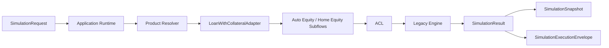

# SDC FASE 3.4D - Loan With Collateral Application Runtime

## 1. Objetivo
Implementar a camada oficial de `Application Runtime` do domínio `Empréstimo com Garantia`, orquestrando `SimulationRequest`, `Product Resolver`, `LoanWithCollateralAdapter`, `Auto Equity / Home Equity Subflows`, ACL, motor legado, `SimulationResult`, `SimulationSnapshot` e `SimulationExecutionEnvelope`.

## 2. Arquitetura
### Camadas introduzidas
- `backend/src/modules/simulation/application/simulation.application.errors.ts`
- `backend/src/modules/simulation/application/simulation.application.context.ts`
- `backend/src/modules/simulation/application/simulation.application.pipeline.ts`
- `backend/src/modules/simulation/application/simulation.application.service.ts`
- `backend/src/modules/simulation/application/simulation.application.runtime.ts`
- `backend/src/modules/simulation/application/index.ts`

### Visao resumida

## 3. Application Runtime
O runtime atua como ponto de entrada orquestrador do backend para o domínio de `Empréstimo com Garantia`.

Ele:
- recebe `SimulationRequest`;
- valida a identidade estrutural mínima da requisição;
- resolve o adapter oficial;
- resolve o subfluxo correspondente;
- executa validação estrutural de colateral;
- executa o caminho de ACL e motor legado já existentes;
- retorna o resultado canônico com snapshot e execution envelope.

## 4. Pipeline
Pipeline explícito implementado:
1. `ValidateRequest`
2. `ResolveProduct`
3. `ResolveSubflow`
4. `ExecuteACL`
5. `ExecuteLegacyEngine`
6. `MapResult`
7. `CreateSnapshot`
8. `CreateExecutionEnvelope`
9. `ReturnSimulationResult`

## 5. Application Service
O serviço de aplicação coordena a execução do pipeline.

Responsabilidades:
- compor a sequência de execução;
- preservar o fluxo controlado de erros;
- manter o runtime independente de UI, controller e persistência;
- consolidar o contexto final da execução.

## 6. Execution Context
O contexto de execução contém:
- `SimulationRequest`;
- `ProductAdapter`;
- `Subflow`;
- `ExecutionId`;
- `CorrelationId`;
- `Metadata`;
- `SimulationResult`;
- `SimulationSnapshot`;
- `SimulationExecutionEnvelope`.

O contexto segue a estrutura de `SimulationProductContext` já existente no domínio de simulação.

## 7. Erros Controlados
Erros introduzidos nesta fase:
- `UnsupportedProductError`
- `UnsupportedSubproductError`
- `InvalidCollateralError`
- `InvalidSimulationRequestError`
- `LegacyExecutionError`

Não há `throw` genérico como contrato de domínio.

## 8. Fluxo de Execução
1. O runtime recebe `SimulationRequest`.
2. O pipeline valida a requisição.
3. O `Product Resolver` encontra o adapter oficial.
4. O adapter resolve o subfluxo correto.
5. O runtime valida a presença estrutural do colateral esperado.
6. O adapter executa a normalização ACL.
7. O adapter executa o motor legado.
8. O resultado canônico é retornado.
9. O snapshot é gerado.
10. O execution envelope é gerado.

## 9. Integração com ACL
O runtime não substitui a ACL existente.

Ele apenas a orquestra dentro do fluxo oficial de aplicação, preservando compatibilidade e o motor legado já validado.

## 10. Integração com Adapter
O `LoanWithCollateralAdapter` segue como componente central de produto.

O runtime usa o adapter para:
- resolver o subfluxo;
- normalizar o contexto;
- executar a simulação;
- construir snapshot;
- construir execution envelope.

## 11. Integração com Snapshot
O `SimulationSnapshot` é criado pelo runtime usando a infraestrutura já existente, preservando request, result e contexto de execução.

## 12. Integração com Execution Envelope
O `SimulationExecutionEnvelope` é produzido sem alterar persistência, motor ou contrato público.

## 13. Limites da Fase
Não foi alterado:
- Workspace;
- `Oportunidades.tsx`;
- `Simulador.tsx`;
- Proposal;
- PDF;
- APIs públicas;
- banco;
- persistência;
- regras financeiras;
- Master Catalog Runtime;
- motor legado.

## 14. Testes
Cobertura criada:
- fluxo completo de application runtime;
- produto suportado;
- subproduto suportado;
- produto não suportado;
- subproduto não suportado;
- collateral inválido;
- erro controlado de requisição inválida;
- falha controlada do motor legado;
- snapshot criado;
- execution envelope criado;
- result retornado.

### Arquivo de teste
- `backend/src/tests/unit/simulation/simulation.application.runtime.test.ts`

## 15. Critério de Encerramento
A fase 3.4D é concluída quando:
1. existir um runtime oficial executável no backend;
2. o fluxo estiver integrado com resolver, adapter, subfluxo, ACL, motor legado, snapshot e envelope;
3. os erros forem controlados;
4. frontend e backend compilarem com sucesso;
5. nenhum cálculo financeiro ou contrato público tenha sido alterado.

## 16. Status Final
**GO WITH RESTRICTIONS**

### Motivo
- a camada de aplicação foi introduzida de forma incremental;
- o legado permaneceu intacto;
- a preparação para a integração controlada do Workspace fica pronta para a próxima fase.
