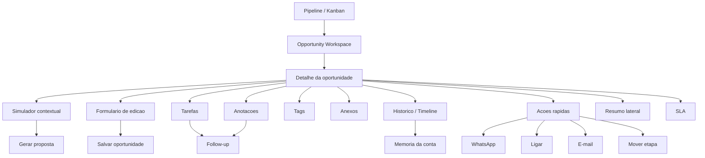
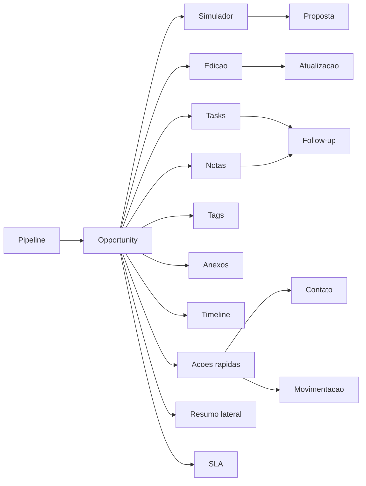

# AUD-EPC-W2-5-CRM-ENTERPRISE-UX-PRODUCTIVITY

## 1. Executive Summary

Esta auditoria avalia a experiencia operacional do CRM no recorte de produtividade enterprise, com foco em Pipeline, Opportunity Workspace, detalhe da oportunidade, simulador embutido, formulario de edicao, tarefas, anotacoes, tags, anexos, historico, acoes rapidas, resumo lateral, SLA e fluxo comercial completo.

A leitura principal e clara:

- O CRM e funcional e cobre o fluxo comercial central.
- A experiencia atual entrega capacidade, mas nao entrega fluidez.
- O Opportunity Workspace concentra demais em uma unica tela e cria custo cognitivo alto.
- Ha redundancia visual entre header, workspace, resumo lateral, tabs e cards.
- O simulador dentro da oportunidade funciona como capacidade de apoio, mas nao como posto de trabalho de alta produtividade.
- Tarefas, anotacoes, tags, anexos e historico estao presentes, mas nao formam um sistema de acao coerente.
- A tela atual favorece verificacao manual de informacao em vez de decisao rapida e execucao guiada.

Conclusao executiva:

**GO WITH RESTRICTIONS**

Motivo:

- Nao ha bloqueio estrutural para operar o CRM.
- O problema principal e de produtividade, clareza e desenho de fluxo.
- O workspace atual precisa de consolidacao de superficie e hierarquizacao de prioridades para atingir padrao enterprise real.

---

## 2. Final Verdict

**GO WITH RESTRICTIONS**

O CRM pode seguir na sua evolucao enterprise, mas com restricoes de experiencia operacional:

- nao tratar a tela atual como destino final;
- reduzir carga visual e tab sprawl;
- transformar o simulador em fluxo contextual;
- transformar o workspace em ambiente de execucao, nao em painel de exibicao;
- separar informacao fixa, informacao automatica e informacao expansivel.

---

## 3. Diagnostico Critico

O desenho atual do CRM de oportunidade parece ter sido construindo para nao perder nenhuma informacao. O efeito colateral e o oposto do desejado: o vendedor precisa olhar demais, decidir demais e clicar demais.

O problema nao e falta de recurso. O problema e excesso de superficie para a mesma decisao.

Hoje o fluxo comercial sofre com:

- many-to-many entre informacao e acao;
- tabs demais para tarefas que deveriam estar inline;
- resumo lateral competindo com o header;
- simulador muito grande para uma acao de ciclo curto;
- edicao de oportunidade pouco centrada no que realmente muda a venda;
- historico, anexos, tags e notas como blocos paralelos, nao como sistema de contexto.

Leitura enterprise:

- O vendedor precisa de 1 workspace.
- O sistema entrega 1 workspace + 1 modal + 1 sidebar + 6 tabs + 1 formulario lateral + 1 simulador completo.
- Isso aumenta o tempo de navegacao, reduz a previsibilidade e eleva o risco de erro operacional.

---

## 4. Principais Dores de UX

### 4.1 Quantidade de cliques por acao critica

Estimativa qualitativa baseada no comportamento atual do workspace.

| Acao critica | Cliques / passos atuais | Leitura |
| --- | ---: | --- |
| Abrir oportunidade a partir do pipeline | 1 | Bom, mas ainda abre uma experiencia densa em seguida. |
| Atualizar oportunidade | 3+ | Abrir detalhe, abrir edicao, salvar. Ainda exige leitura de muitos campos irrelevantes. |
| Registrar follow-up | 2 a 4 | Depende de abrir tab correta e usar area nao dedicada. |
| Adicionar anotacao | 2 a 3 | Precisa localizar o bloco certo e salvar em contexto pouco privilegiado. |
| Simular proposta | 5 a 8 | Abrir workspace, entrar no simulador, preencher, calcular, interpretar, agir. |
| Gerar proposta | 5 a 7 | O fluxo e possivel, mas nao e rapido. |
| Mover etapa da oportunidade | 1 a 2 | A acao existe, mas compete com muita informacao ao redor. |
| Reagendar ou priorizar SLA | 2 a 4 | SLA e visivel, mas a acao corretiva nao parece primaria. |

Leitura:

- O numero de cliques nao e o maior problema isolado.
- O maior problema e a quantidade de decodificacao que acontece entre os cliques.

### 4.2 Clareza visual

- Baixa para o usuario que esta em ritmo de venda.
- O workspace exibe demais ao mesmo tempo.
- O olho do vendedor disputa entre header, tabs, simulador, resumo, SLA e acoes rapidas.

### 4.3 Excesso de abas

- Tarefas, anotacoes, simulador, tags, anexos e historico criam um modelo de "arquivamento por aba".
- Isso e util para organizacao interna, mas ruim para execucao de venda.

### 4.4 Excesso de informacoes

- Informacao de cliente, oportunidade, status, valor, owner, SLA, tags e historico aparecem em mais de um lugar.
- O usuario precisa filtrar mentalmente o que e decisivo e o que e apenas referencia.

### 4.5 Fluxo real do vendedor

O vendedor nao pensa em "tabs". Ele pensa em:

1. entender status atual;
2. ver o proximo passo;
3. simular ou ajustar proposta;
4. registrar contato;
5. mover etapa;
6. gerar entrega comercial.

O workspace atual ainda nao reflete essa ordem de trabalho com suficiente nitidez.

### 4.6 Tempo para simular

- Hoje tende a ser alto por conta do numero de campos, campos condicionais e leitura do resultado.
- O tempo maior nao esta no calculo, e sim na preparacao e interpretacao.

### 4.7 Tempo para gerar proposta

- A acao existe, mas esta acoplada a um simulador que carrega muitas decisoes previas.
- A proposta deveria nascer do resultado da simulacao com um caminho mais curto.

### 4.8 Tempo para atualizar oportunidade

- A edicao inclui informacoes suficientes, porem nao necessariamente as informacoes certas.
- O formulario mistura o que e estrutural com o que e circunstancial.

### 4.9 Tempo para registrar follow-up

- Follow-up deveria ser uma acao primaria e instantanea.
- Hoje ele parece diluido em notas, tarefas e historico.

### 4.10 Redundancias visuais

- Resumo lateral repete partes do header.
- Tags aparecem em card, workspace e detalhe.
- SLA e status competem com informacao comercial.
- Historico e anotacoes podem duplicar a narrativa do atendimento.

### 4.11 Componentes que competem por atencao

- simulador;
- resumo lateral;
- SLA;
- tabs;
- formulario de edicao;
- acoes rapidas;
- historico;
- anexos.

### 4.12 Campos desnecessarios no momento errado

- campos avancados de simulacao antes da confirmacao de necessidade;
- metadados de anexos antes da acao de upload;
- detalhes de historico antes da conclusao da tarefa atual;
- tags quando o foco deveria ser proximo passo comercial.

### 4.13 Informacoes que deveriam ser automaticas

- status da oportunidade a partir da etapa;
- SLA a partir do ultimo evento;
- contexto de cliente a partir do CRM Cliente;
- recomendacao de proxima acao;
- preenchimento de campos default de simulacao;
- data/hora da ultima interacao;
- owner e responsavel inicial em fluxos guiados.

### 4.14 Informacoes que deveriam ficar fixas

- nome do cliente;
- valor da oportunidade;
- etapa atual;
- owner;
- SLA sintetico;
- proximo passo recomendado.

### 4.15 Informacoes que deveriam ficar ocultas ate serem necessarias

- parametros secundarios de simulacao;
- historico completo;
- gestao de anexos;
- edicao de tags detalhada;
- detalhes de auditoria e timeline expandida.

---

## 5. Mapa de Friccao Operacional

| Area | Friccao | Impacto | Severidade |
| --- | --- | --- | --- |
| Pipeline | precisa abrir o detalhe para entender contexto operacional completo | reduz velocidade de triagem | Alta |
| Opportunity Workspace | muitas superficies ao mesmo tempo | aumenta carga cognitiva | Critica |
| Detalhe da oportunidade | informacao util misturada com informacao de apoio | dificulta decisao | Alta |
| Simulador dentro da oportunidade | pesado para tarefas de ciclo curto | aumenta tempo ate a proposta | Critica |
| Formulario de edicao | edita pouco e mostra demais | gera ruido e hesitacao | Alta |
| Tarefas | nao parecem estar no centro da operacao | follow-up perde prioridade | Alta |
| Anotacoes | dependem de contexto manual | baixa friccao, mas baixa visibilidade | Media |
| Tags | baixa relevancia primaria na rotina de venda | poluicao visual | Media |
| Anexos | utilitarios, mas nao prioritarios | competem com acao comercial | Media |
| Historico / Timeline | informativo, porem passivo | consumo de tela sem orientacao | Alta |
| Acoes rapidas | existem, mas nao lideram o fluxo | oportunidade perdida de produtividade | Alta |
| Resumo lateral | repete contexto ja visivel | redundancia | Alta |
| SLA | importante, mas subutilizado como gatilho de acao | risco de virar indicador decorativo | Alta |

---

## 6. Mapa Arquitetural do CRM

### 6.1 Leitura de dominios no fluxo comercial

### 6.2 Leitura executiva do mapa

- O Pipeline e a porta de entrada.
- O Opportunity Workspace deveria ser o centro de decisao.
- O simulador deveria ser uma ferramenta contextual de aceleracao, nao uma tela paralela.
- O formulario de edicao deveria atuar como ajuste rapido, nao como area de configuracao geral.
- Tasks, Notes, Tags, Attachments e Timeline deveriam funcionar como extensoes do fluxo, nao como blocos concorrentes.

---

## 7. Grafo de Dependencias

### 7.1 Dependencia funcional

### 7.2 Leitura das dependencias

- O simulador depende do contexto da oportunidade.
- A proposta depende do resultado da simulacao.
- O follow-up depende de tasks ou notas, mas deveria ser unificado.
- O SLA depende da ultima interacao e da etapa, mas nao deveria exigir interpretacao manual.

---

## 8. Jornada Ideal do Vendedor

### 8.1 Jornada atual, em termos práticos

1. Abre o pipeline.
2. Encontra a oportunidade.
3. Entra no detalhe.
4. Procura o que precisa em meio a muitas superficies.
5. Vai para o simulador ou para a edicao.
6. Volta para registrar acao.
7. Revalida status, SLA e historico.

### 8.2 Jornada ideal

1. Ver fila priorizada.
2. Abrir oportunidade com resumo util e acao recomendada.
3. Executar uma acao primaria imediata.
4. Simular com poucos campos.
5. Gerar proposta sem sair do contexto.
6. Registrar follow-up em um clique.
7. Mover etapa ou agendar proximo passo.

### 8.3 Princípios da jornada ideal

- menos tabs, mais contexto progressivo;
- menos leitura manual, mais automacao;
- menos formulação de tela, mais formulario adaptativo;
- menos memoria do usuario, mais memoria do sistema;
- menos duplicidade, mais hierarquia.

---

## 9. Proposta de Novo Opportunity Workspace

### 9.1 Papel do workspace

O workspace deve ser o cockpit do vendedor. Ele precisa responder, em segundos:

- o que esta acontecendo;
- o que eu devo fazer agora;
- quanto vale;
- em que etapa esta;
- qual o risco;
- qual a proxima acao.

### 9.2 Estrutura sugerida

#### Topo fixo

- nome da oportunidade;
- cliente;
- valor;
- etapa;
- owner;
- SLA sintetico;
- proxima acao.

#### Coluna principal

- area de acao primaria;
- simulador compacto;
- proposta;
- registro rapido de follow-up;
- transicao de etapa.

#### Coluna lateral

- resumo expandido;
- contatos;
- atividade recente;
- anexos recentes;
- tags;
- notas resumidas.

### 9.3 Mudancas de desenho

- tornar o topo fixo e denso em informacao fixa;
- reduzir a quantidade de tabs visiveis;
- transformar tabs em expansoes sob demanda;
- mover historico para uma visao consolidada, nao concorrente;
- deixar SLA como sinal de risco, nao apenas como card;
- permitir que a acao primaria seja executada sem mudar de contexto.

### 9.4 O que sairia da area principal

- historico completo;
- edicao detalhada;
- anexos com metadata completa;
- gestao detalhada de tags;
- informacoes raramente alteradas.

### 9.5 Resultado esperado

- leitura mais rapida;
- menos ruido visual;
- menor tempo ate a acao;
- maior previsibilidade;
- mais adoção real pelo vendedor.

---

## 10. Proposta de Novo Simulador Dentro da Oportunidade

### 10.1 Principio central

O simulador nao deve parecer uma pagina de parametrizacao. Ele deve parecer uma calculadora comercial contextual.

### 10.2 O que o simulador precisa mostrar primeiro

- tipo de simulacao;
- produto selecionado;
- entradas essenciais;
- resultado resumido;
- impacto comercial;
- acao seguinte.

### 10.3 O que deve ficar escondido ate ser necessario

- campos avancados;
- variacoes secundarias;
- detalhes tecnicos;
- parametros de suporte;
- informacoes de auditoria.

### 10.4 Fluxo ideal

1. escolher o tipo de simulacao;
2. preencher apenas o minimo necessario;
3. calcular automaticamente ou com 1 acao clara;
4. ver resultado em bloco resumido;
5. revisar recomendacao;
6. gerar proposta ou ajustar;
7. salvar contexto sem sair da oportunidade.

### 10.5 Regras de UX para o simulador

- uma acao principal por tela;
- resultados sempre acima da dobra;
- campos agrupados por intençao, nao por implementacao;
- defaults automáticos sempre que o sistema puder inferir;
- expansao progressiva para cenarios avancados.

### 10.6 Resultado esperado

- menos tempo ate a primeira simulacao;
- menos erro de preenchimento;
- maior taxa de conclusao;
- maior conversao de simulacao em proposta.

---

## 11. Proposta de Novo Formulario de Edicao

### 11.1 Problema atual

O formulario de edicao parece carregar mais estrutura do que necessidade real de atualizacao.

### 11.2 Formulario ideal

Campos prioritarios:

- titulo da oportunidade;
- pipeline;
- etapa;
- valor;
- owner;
- observacao operacional.

Campos secundários, sob expansao:

- classificacoes avancadas;
- ajustes de apoio;
- dados historicos;
- campos de backoffice.

### 11.3 O que nao deveria estar no fluxo principal

- dados do cliente que pertencem ao CRM Cliente;
- informacoes de baixa frequencia;
- estados que o sistema ja deveria conhecer;
- campos redundantes com o resumo lateral.

### 11.4 Princípio de edicao

Editar oportunidade deve ser rapida e segura. Se o usuario precisa pensar por muito tempo antes de salvar, o formulario esta grande demais.

### 11.5 Resultado esperado

- menos hesitacao;
- menos erro;
- menos tempo de preenchimento;
- mais foco no que altera a venda.

---

## 12. Proposta de Acoes Rapidas

### 12.1 Acoes que deveriam ser primarias

- WhatsApp;
- ligar;
- e-mail;
- adicionar follow-up;
- gerar proposta;
- mover etapa;
- editar oportunidade;
- anexar documento;
- marcar tag importante.

### 12.2 Regras para quick actions

- devem estar sempre visiveis;
- devem ser poucas;
- devem ter ordem por frequencia real de uso;
- devem exigir o minimo de navegação;
- devem evitar duplicar a mesma acao em varios lugares com nomes diferentes.

### 12.3 Acoes secundarias

- historico completo;
- tags detalhadas;
- anexos completos;
- configuracoes avancadas;
- visualizacao de auditoria.

### 12.4 Resultado esperado

- menos clique para contato;
- menos clique para follow-up;
- menos clique para mover oportunidade;
- mais execucao em sequencia.

---

## 13. Ganhos Esperados de Produtividade

### 13.1 Em tempo

- menor tempo para achar a acao correta;
- menor tempo para interpretar a oportunidade;
- menor tempo para simular;
- menor tempo para gerar proposta;
- menor tempo para registrar follow-up.

### 13.2 Em qualidade de operacao

- maior consistencia do fluxo comercial;
- menor risco de perder contexto;
- mais clareza do proximo passo;
- menos retrabalho por informacao redundante.

### 13.3 Em adoção

- vendedor usa mais porque entende mais rapido;
- lider usa mais porque o workspace fica mais previsivel;
- operacao usa mais porque o fluxo fica menos pesado.

### 13.4 Leitura objetiva

Se o workspace reduzir 20% a 35% da friccao atual, o ganho percebido pelo usuario sera maior do que o ganho puramente tecnico.

---

## 14. Riscos

| Risco | Impacto | Leitura |
| --- | --- | --- |
| manter tudo visivel ao mesmo tempo | alta carga cognitiva | o vendedor ignora parte da tela |
| manter tabs como estrutura principal | perda de velocidade | a acao vira navegação |
| manter simulador grande demais | queda de conclusao | o fluxo trava antes da proposta |
| manter resumo lateral redundante | poluicao visual | informacao importante perde destaque |
| tratar SLA como card isolado | baixa acao corretiva | indicador sem processo |
| manter historico como bloco passivo | baixa utilidade pratica | memoria sem orientacao |
| editar oportunidade com campos demais | erro e lentidao | formulario pesa mais do que ajuda |

---

## 15. Consolidacao e Direcao Enterprise

### 15.1 Oportunidades de consolidacao

- transformar o workspace em tela unica orientada a acao;
- consolidar notas, tarefas e follow-up em um modelo de atividade mais claro;
- reduzir a distancia entre simulacao e proposta;
- reforcar o papel do SLA como indicador acionavel;
- separar o que e identidade fixa do que e contexto mutavel;
- esconder o que e avancado ate o momento certo.

### 15.2 Direcao enterprise recomendada

- cockpit de decisao, nao dashboard de exibicao;
- contextual por etapa do pipeline;
- progressive disclosure;
- quick actions acima da dobra;
- simulador curto, acionavel e orientado a proposta;
- historico e anexos como apoio, nao como protagonistas.

### 15.3 O que nao fazer

- nao criar nova arquitetura paralela;
- nao multiplicar visoes sem reduzir friccao;
- nao transformar o workspace em um mini-ERP visual;
- nao resolver UX com mais abas;
- nao esconder problema de organizacao por meio de densidade.

---

## 16. Conclusao

O CRM atual tem capacidade, mas ainda nao tem a melhor forma de uso para rotina de venda enterprise.

O diagnostico final e este:

- a experiencia e operavel;
- a experiencia nao e suficientemente produtiva;
- a tela entrega muito conteudo, mas pouca orientacao;
- o vendedor tem acesso a tudo, mas nao a um fluxo claro;
- a consolidacao precisa ser de UX e de priorizacao, nao de funcionalidades.

### Veredito final

**GO WITH RESTRICTIONS**

### Motivo do veredito

- o CRM suporta o fluxo comercial principal;
- ha ganhos claros de produtividade possiveis sem alterar backend ou contratos;
- a experiencia atual, porem, precisa de consolidacao forte antes de ser considerada enterprise madura.

