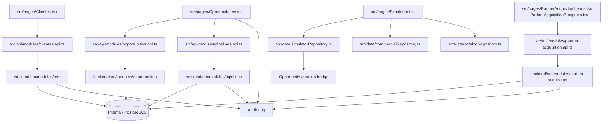

# AUD-EPC-W2-CRM-CONSOLIDATION

## 1. Executive Summary

Esta auditoria cruza o DCA Mestre, o PCCD e o estado real do repositorio para avaliar a consolidacao do dominio CRM no EPC-W2.

Conclusao executiva:

- O core de CRM Clientes, Pipeline e Opportunity esta em estado forte e alinhado ao DCA.
- O backend mostra tenant scope, RBAC e audit trail consistentes nos fluxos auditados.
- O frontend ja consome os contratos oficiais na maior parte do CRM, mas ainda carrega superfices de compatibilidade, heuristicas de apoio e alguns fallbacks locais.
- O dominio de Partner Acquisition esta bem definido, mas a exposicao de navegacao e parte do runtime de apoio ainda se comportam como transicao controlada.
- O Simulador continua sendo a principal area parcial do recorte CRM, porque depende de estado em memoria, repositories locais e enriquecimento externo direto.

Veredito consolidado:

**GO WITH RESTRICTIONS**

## 2. Final Verdict

O CRM Enterprise pode seguir para consolidacao do EPC-W2 com restricoes.

Motivos:

- Nao foram identificados bloqueadores P0 no recorte auditado.
- Nao foram identificados bloqueadores P1 no recorte auditado.
- Persistem riscos P2/P3 em simulador, compat layers, heuristicas de apoio e surfaces legadas de navegacao.
- O runtime oficial principal ja esta em backend-first, tenant-scoped e RBAC-driven.

## 3. CRM Enterprise Maturity Score

| Dimensao | Score | Leitura |
| --- | ---: | --- |
| CRM Clientes | 90/100 | Runtime oficial, contratos e tenant scope consistentes. |
| Pipeline / Opportunity | 88/100 | Backend owner claro, frontend ainda possui heuristicas de compatibilidade. |
| CRM Parceiros | 84/100 | Domínio funcional, ainda com posicao operacional transicional. |
| Partner Acquisition | 86/100 | Contratos e workflow bem definidos, com navegacao ainda em consolidacao. |
| Simulator | 72/100 | Funciona, mas ainda depende de estado em memoria e fallback local. |
| Frontend Reality | 78/100 | Boa aderencia a APIs oficiais, ainda com apoio local e compatibilidade. |
| Backend Reality | 90/100 | Repositories, services, audit e tenant scope bem delimitados. |
| RBAC / Tenant Scope | 92/100 | Protecao consistente nas rotas auditadas. |
| Auditability | 91/100 | Log de auditoria presente em criacao e mutacao relevantes. |
| Performance / UX | 79/100 | Estrutura boa, porem telas pesadas e simulador continuam extensos. |
| Architectural Consistency | 84/100 | Coerente com o DCA, com residuos de compatibilidade. |

**CRM Enterprise Maturity Score consolidado: 83/100**

## 4. Mapa Arquitetural do CRM

| Dominio | Artefatos principais | Status | Observacao |
| --- | --- | --- | --- |
| CRM Clientes | `src/pages/Clientes.tsx`, `src/routes/crm.routes.tsx`, `backend/src/modules/crm/routes.ts`, `backend/src/modules/crm/services/customers.service.ts`, `backend/src/modules/crm/repositories/customers.repository.ts` | READY | Ownership claro e tenant scoped. |
| Leads | `backend/src/modules/crm/services/leads.service.ts`, `backend/src/modules/crm/repositories/leads.repository.ts`, `backend/src/modules/crm/routes.ts` | READY | Audit trail e CRUD oficial presentes. |
| Pipeline | `src/pages/Oportunidades.tsx`, `src/api/modules/pipelines.api.ts`, `backend/src/modules/pipelines/routes.ts`, `backend/src/modules/pipelines/service.ts`, `backend/src/modules/pipelines/repository.ts` | READY | Backbone canonico do kanban comercial. |
| Opportunity | `src/pages/Oportunidades.tsx`, `src/api/modules/opportunities.api.ts`, `backend/src/modules/opportunities/routes.ts`, `backend/src/modules/opportunities/services/opportunities.service.ts` | READY | Backend-owned, com heuristicas de frontend ainda visiveis. |
| CRM Parceiros | `src/pages/Parceiros.tsx`, `backend/src/modules/partners/*` | PARTIAL | Funcional, mas ainda nao aparece como bloco de experiencia totalmente limpo. |
| Partner Acquisition | `src/pages/PartnerAcquisitionLeads.tsx`, `src/pages/PartnerAcquisitionProspects.tsx`, `src/api/modules/partner-acquisition.api.ts`, `backend/src/modules/partner-acquisition/http/partner-acquisition.routes.ts` | READY WITH RESTRICTIONS | Contratos maduros; navegacao ainda transicional em Operacoes. |
| Simulator | `src/pages/Simulador.tsx`, `src/data/simulatorRepository.ts`, `src/data/commercialRepository.ts`, `src/data/catalogRepository.ts` | PARTIAL | Maior area de compat/fallback do recorte CRM. |

## 5. Grafo de Dependencias

Leitura do grafo:

- O caminho canonico de CRM passa por frontend -> API module -> backend module -> Prisma.
- O Simulador ainda e um desvio controlado, porque opera com repositories locais e estado em memoria.
- Partner Acquisition ja tem fronteira backend propria, com validação, tenant scope e idempotencia.

## 6. Duplicidades Encontradas

| Achado | Evidencia | Severidade | Leitura |
| --- | --- | --- | --- |
| Aliases de rota para compatibilidade | `src/routes/crm.routes.tsx`, `src/routes/operacoes.routes.tsx`, `src/routes/admin.routes.tsx`, `src/routes/hub.routes.tsx` | P3 | Duplicidade intencional, deve permanecer invisivel ate o corte final. |
| Compat layer HTTP | `src/api/client.ts` | P2 | Nao e o runtime oficial; existe como camada de compatibilidade. |
| Dupla superfice de apoio para catalogo/simulador | `src/data/catalogRepository.ts`, `src/data/commercialRepository.ts` | P2 | Sobreposicao de responsabilidade para dados de apoio. |
| Estado em memoria do simulador | `src/data/simulatorRepository.ts` | P2 | Mantem simulações, propostas e oportunidades em runtime local. |
| Heuristicas e normalizacao de identidade no kanban | `src/pages/Oportunidades.tsx` | P2 | O frontend ainda reconcilia aliases e identificadores legados. |
| Exposicao operacional de Partner Acquisition | `src/routes/operacoes.routes.tsx`, `src/pages/PartnerAcquisitionLeads.tsx` | P3 | Funcional, mas ainda nao traduz o bloco como CRM-first. |

## 7. Riscos

| Risco | Severidade | Impacto | Bloqueia producao? |
| --- | --- | --- | --- |
| Simulator sem persistencia canonica | P2 | Perda de rastreabilidade e divergencia entre sessao e backend. | Nao |
| `Oportunidades.tsx` ainda com heuristicas de apoio | P2 | Aumenta complexidade e custo de manutencao. | Nao |
| `catalogRepository` e `commercialRepository` como suporte local | P2 | Pode confundir ownership futuro de catalogo e pipeline. | Nao |
| `api/client.ts` como compat layer ativa no repositorio | P2 | Mantem narrativa legada de consumo HTTP. | Nao |
| Alias de navegacao ainda presente para compatibilidade | P3 | Pode manter bookmarks e links antigos vivos por mais tempo. | Nao |
| Chamada externa direta de CEP em `Oportunidades.tsx` | P2 | Introduz dependencia externa fora do contrato principal. | Nao |

## 8. Oportunidades de Consolidacao

- Isolar o Simulador para que ele fique apenas como consumidor de dados oficiais, sem estado operacional proprio.
- Reduzir `catalogRepository` e `commercialRepository` a suporte estrito ou aposentacao progressiva quando nao houver consumidores.
- Remover heuristicas de reconciliacao de identidade do fluxo principal de `Oportunidades` quando a cobertura oficial de contrato estiver completa.
- Manter aliases apenas como redirecionamento invisivel ate o corte de bookmarks e referencias legadas.
- Separar melhor a narrativa visual de Partner Acquisition da narrativa de Operacoes, sem criar nova arquitetura.

## 9. RBAC e Tenant Scope

Evidencias de alinhamento:

- `backend/src/modules/crm/routes.ts` aplica `authenticate`, `tenantContextMiddleware` e `requirePermissions`.
- `backend/src/modules/pipelines/routes.ts` aplica `authenticate`, `tenantContextMiddleware` e `requirePermissions`.
- `backend/src/modules/partner-acquisition/http/partner-acquisition.routes.ts` aplica `authenticate`, `tenantContextMiddleware`, validacao de tenant e idempotencia.
- `backend/src/modules/opportunities/services/opportunities.service.ts` valida tenant scope e registra audit log.
- `backend/src/modules/partner-acquisition/repositories/partner-acquisition.prisma.repository.ts` opera sob filtro de tenant.

Leitura:

- O tenant scope e o RBAC estao corretos nos fluxos oficiais.
- Nao ha evidencia de ownership de negocio no frontend.
- As labels legadas no frontend nao alteram a fonte de verdade de acesso.

Status: **READY**

## 10. Backend Reality Audit

Pontos fortes:

- CRM, Pipeline, Opportunity e Partner Acquisition estao servidos por modulos backend separados.
- Os endpoints auditados seguem o contrato `/api/v1`.
- Os services registram audit log em criacao, update, move e transicoes relevantes.
- As reposicoes oficiais usam tenant filter e contratos tipados.

Pontos de atencao:

- `backend/src/modules/partner-acquisition/http/partner-acquisition.routes.ts` e a `partner-acquisition` domain stack estao maduros, mas ainda fazem parte de uma area em consolidacao visual.
- `backend/src/index.ts` possui superficies legadas fora do core CRM, mas nao compoem bloqueio do dominio auditado.

## 11. Frontend Reality Audit

Pontos fortes:

- As paginas de CRM consomem APIs oficiais.
- O layout enterprise e o PageHeader ja tratam breadcrumbs e titulo contextual.
- O menu principal esta consolidado em CRM, Operacoes, FINQZ HUB e Administracao.

Pontos de atencao:

- `src/api/client.ts` permanece como compat layer, embora nao apareca como import ativo no runtime CRM.
- `src/store/index.ts` preserva apenas estado de UI e preferencias, incluindo `localStorage` para avatar e experiencia.
- `src/pages/Oportunidades.tsx` ainda agrega muita responsabilidade de composicao e reconciliacao de identidade.
- `src/pages/Simulador.tsx` continua dependente de repositories locais e enriquecimento externo direto.

Status: **PARTIAL**

## 12. Gateway de Produção

| Item | Resultado | Evidencia |
| --- | --- | --- |
| Build frontend | PASS | `npm run build` no root concluiu com sucesso. |
| Testes frontend | PASS | `npm test` no root concluiu com `17` files e `69` testes aprovados. |
| Build backend | PASS | `npm run build` em `backend` concluiu com `tsc`. |
| Testes backend | PASS | `npm test` em `backend` concluiu com `107` files e `749` testes aprovados. |
| Tenant scope | PASS | Backend valida tenant em CRM, Pipelines e Partner Acquisition. |
| RBAC | PASS | Rotas sensiveis aplicam `requirePermissions`. |
| Auditoria | PASS | Services registram audit log nos fluxos centrais. |
| Observabilidade | PASS | A plataforma ja possui health/readiness e logs documentados. |
| Responsividade basica | PASS COM RESTRICOES | Estrutura de layout e navegacao suportam uso responsivo, mas o recheck visual dedicado nao foi executado neste turno. |

## 13. Gap Matrix

| Gap | Area | Severidade | Estado |
| --- | --- | --- | --- |
| Simulator sem persistencia canonica | CRM / Simulator | P2 | Aberto |
| Compat layer HTTP ainda presente | Frontend / API | P2 | Aberto |
| Fallback local de catalogo e comercial | CRM / Support Data | P2 | Aberto |
| Heuristicas de identidade no kanban | Opportunity / Pipeline | P2 | Aberto |
| Labels e aliases legados na navegacao | Navigation / UX | P3 | Aberto |
| External fetch direto para CEP | Opportunity UX | P2 | Aberto |

## 14. Go-Live Blockers

### P0 remanescentes

Nenhum identificado no recorte auditado.

### P1 remanescentes

Nenhum identificado no recorte auditado.

### P2/P3 remanescentes

- Simulator ainda depende de estado em memoria e support repositories.
- Frontend ainda possui heuristicas de apoio para conciliacao de pipeline/opportunity.
- Existe compat layer HTTP historica no repositorio.
- Aliases e redirecionamentos ainda existem por compatibilidade.
- A narrativa visual de Partner Acquisition ainda passa por Operacoes.

## 15. P0/P1/P2/P3 Findings

### P0

- Nenhum.

### P1

- Nenhum.

### P2

- `src/pages/Simulador.tsx` e `src/data/simulatorRepository.ts` mantem runtime local de apoio.
- `src/pages/Oportunidades.tsx` ainda carrega reconciliacao de identidade, normalizacao e heuristicas auxiliares.
- `src/data/catalogRepository.ts` e `src/data/commercialRepository.ts` ainda funcionam como suporte local e fallback.
- `src/api/client.ts` continua como facade de compatibilidade.
- `src/pages/Oportunidades.tsx` faz fetch direto ao ViaCEP para preenchimento de endereco.

### P3

- Aliases de rota e labels legadas continuam visiveis como compatibilidade de navegacao.
- Algumas labels de permissao e modulo ainda refletem heranca de organizacao anterior.

## 16. Plano de Fechamento por Sprint

### Sprint 1

- Isolar o simulador como consumidor estrito de contratos oficiais.
- Reduzir a superficie de fallback local em catalogo/comercial.

### Sprint 2

- Enxugar heuristicas de identidade no fluxo de oportunidade.
- Revisar labels legadas de permissao e modulo para harmonizacao editorial.

### Sprint 3

- Aposentar compat layers sem consumidor ativo.
- Encerrar aliases de navegacao quando o corte de bookmarks estiver seguro.

## 17. Recomendações

- Manter o CRM core como pronto para Go-Live com restricoes.
- Tratar o Simulador como principal item de consolidacao remanescente.
- Preservar compatibilidade de navegacao ate o corte final de consumidores.
- Evitar qualquer movimento de arquitetura paralela ou fonte de verdade duplicada.

## 18. Parecer Final

O CRM Enterprise esta suficientemente maduro para seguir em consolidacao de EPC-W2, desde que as restricoes sejam mantidas e o simulador nao seja reclassificado como runtime canônico sem uma onda propria.

**Veredito final: GO WITH RESTRICTIONS**
