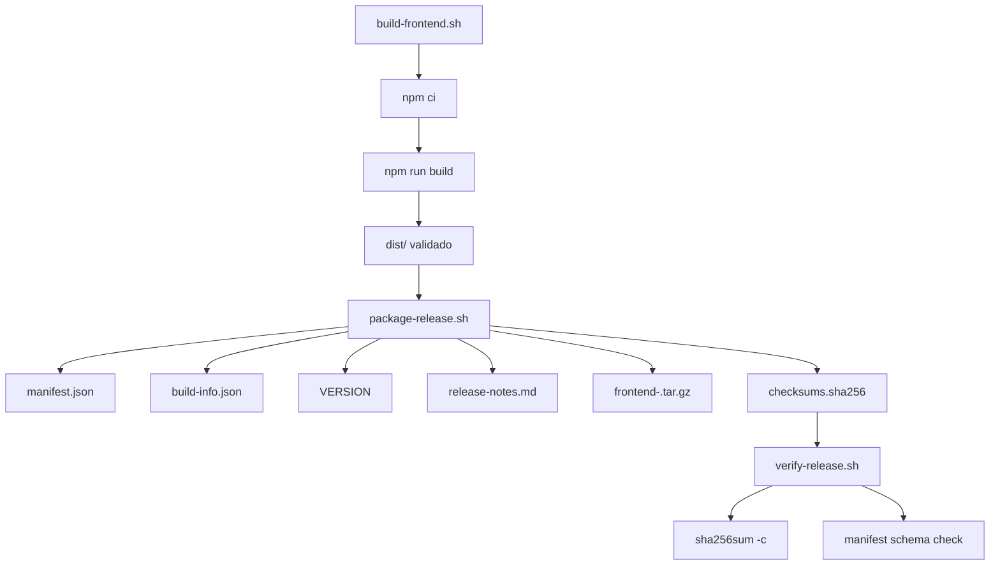

# EPC-W5-03D - Enterprise Release Pipeline

## 1. Resumo executivo

Este documento define a trilha minima e deterministica para gerar artefatos oficiais de release do FINQZ PRO Enterprise sem executar deploy, rollback ou publicacao de ambiente.

O pipeline foi desenhado para:

- construir o frontend com validacao objetiva de `dist/`;
- empacotar metadados auto-gerados de release;
- gerar checksum verificavel para todos os artefatos;
- manter o contrato de deploy fora do escopo desta entrega;
- preservar a compatibilidade com o fluxo atual de release do repositorio.

## 2. Escopo

Incluido:

- `scripts/build/build-frontend.sh`
- `scripts/release/package-release.sh`
- `scripts/release/verify-release.sh`
- `release/schemas/manifest.schema.json`
- artefatos em `release/artifact/`
- documentacao operacional desta trilha

Excluido:

- deploy
- rollback
- alteracao de backend
- alteracao de Nginx
- alteracao de banco
- alteracao de Redis
- alteracao do contrato da API
- alteracao do TTL de JWT

## 3. Fluxo operacional

1. `build-frontend.sh`
2. `package-release.sh`
3. `verify-release.sh`

O fluxo e intencionalmente linear. Cada etapa falha imediatamente em erro e nao depende de state externo fora do repo e das variaveis de runtime.

## 4. Arquitetura

### 4.1 Build frontend

O script de build:

- executa `npm ci`;
- executa `npm run build`;
- confirma que `dist/` foi materializado;
- valida que o bundle final contem ao menos um arquivo e `dist/index.html`.

### 4.2 Empacotamento

O script de empacotamento:

- chama o build frontend;
- resolve branch, commit e versao diretamente do Git;
- gera `manifest.json`;
- gera `build-info.json`;
- gera `VERSION`;
- gera `release-notes.md`;
- copia `dist/` para `release/artifact/`;
- gera `frontend-<commit>.tar.gz`;
- gera `checksums.sha256` para todos os artefatos.

### 4.3 Verificacao

O script de verificacao:

- confirma existencia dos arquivos obrigatorios;
- confirma existencia do tarball nomeado pelo commit;
- valida a estrutura basica do manifest contra o schema;
- executa a verificacao dos SHA-256.

## 5. Manifest oficial

O manifest contem os campos obrigatorios:

- `application`
- `artifactVersion`
- `environment`
- `branch`
- `commit`
- `release`
- `createdAt`
- `frontend.framework`
- `frontend.bundler`
- `backend.image`

Fonte de verdade:

- `backend.image` vem de `FINQZ_BACKEND_IMAGE`;
- `artifactVersion` e `release` sao derivados automaticamente de Git;
- `createdAt` e registrado em UTC;
- `branch` e `commit` tambem sao derivados de Git.

## 6. Build-info

O arquivo `build-info.json` registra:

- sistema operacional;
- versao do Node;
- versao do npm;
- branch Git;
- commit Git;
- timestamp UTC;
- builder;
- versao do Vite.

Esse arquivo serve como evidência operacional do ambiente que gerou o artefato.

## 7. Checksum

`checksums.sha256` cobre todos os arquivos do pacote, exceto o proprio arquivo de checksum.

Isso permite:

- detectar corrupcao;
- detectar alteracao manual apos o empacotamento;
- validar a integridade do tarball e dos metadados.

## 8. Schema

`release/schemas/manifest.schema.json` foi criado em JSON Schema Draft 2020-12 para permitir validacao externa e padronizada do manifest.

## 9. Mermaid

## 10. Evidencias

Evidencias registradas por esta entrega:

- estrutura de release criada no repositorio;
- schema oficial do manifest;
- scripts bash compatíveis com Ubuntu/Linux;
- documentacao da arquitetura do pacote.

## 11. Riscos

- `FINQZ_BACKEND_IMAGE` precisa estar presente no ambiente que executa o empacotamento;
- o pacote nao realiza deploy, entao a etapa de publicacao continua fora deste escopo;
- em workspace sujo, `artifactVersion` pode refletir o estado atual do Git e nao um tag limpo de release.

## 12. Pendencias

- integrar estes scripts ao workflow CI/CD;
- definir se o release final deve fixar `FINQZ_BACKEND_IMAGE` por tag ou digest no pipeline oficial;
- adicionar validação automatizada do schema em CI, se desejado.

## 13. Proxima etapa recomendada

Adicionar uma etapa de CI que execute:

1. `scripts/build/build-frontend.sh`
2. `scripts/release/package-release.sh`
3. `scripts/release/verify-release.sh`

sem acoplar deploy ou rollback.
