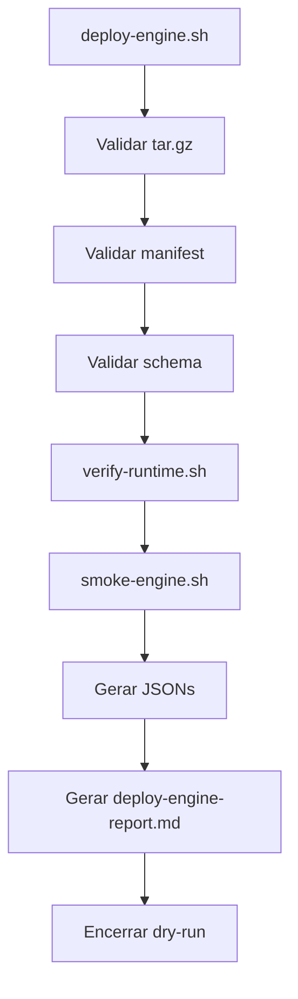

# EPC-W5-03D-R3 - Enterprise Deploy Engine (Dry-Run)

## 1. Resumo Executivo

Esta fase implementa a primeira versao do Enterprise Deploy Engine do FINQZ PRO Enterprise em modo `dry-run` בלבד. O objetivo e validar o artefato de release, confirmar o manifest e o schema, verificar checksums, checar o runtime local e gerar evidencias sem executar deploy real.

Nao ha alteracao de HML, producao, Docker, Nginx, backend, frontend, banco, Prisma, GitHub Actions, containers, volumes, serviços Linux, systemd, SSH ou firewall.

## 2. Escopo

Incluido:

- `scripts/deploy/deploy-engine.sh`
- `scripts/deploy/verify-runtime.sh`
- `scripts/deploy/smoke-engine.sh`
- `scripts/deploy/rollback-engine.sh`
- `docs/06-release/EPC-W5-03D-R3-DEPLOY-ENGINE.md`

Tambem sao gerados:

- `deploy-engine-report.md`
- `runtime-check.json`
- `artifact-validation.json`
- `dry-run.json`

Excluido:

- deploy real
- rollback real
- alteracoes em HML
- alteracoes em producao
- alteracoes em infraestrutura

## 3. Arquitetura Final

O engine segue a sequencia:

1. receber o artefato;
2. validar `tar.gz`;
3. validar manifest;
4. validar JSON Schema;
5. validar runtime local;
6. validar estrutura esperada;
7. executar smoke validation;
8. gerar evidencias;
9. encerrar em modo `dry-run`.

## 4. Responsabilidades

### deploy-engine.sh

- coordena o fluxo;
- exige `--dry-run`;
- valida artefato, manifest e schema;
- chama runtime check;
- chama smoke check;
- gera `dry-run.json` e `deploy-engine-report.md`.

### verify-runtime.sh

- verifica espaço em disco;
- verifica permissões e leitura;
- confirma `release/`, `scripts/` e `logs/`;
- confirma acesso ao artefato;
- gera `runtime-check.json`.

### smoke-engine.sh

- valida `dist/index.html`;
- valida `dist/`;
- valida `manifest.json`;
- valida `checksums.sha256`;
- gera `artifact-validation.json`.

### rollback-engine.sh

- expõe apenas a interface;
- registra logs;
- não executa rollback.

## 5. Fluxo Mermaid

## 6. Evidências Geradas

- `runtime-check.json`
- `artifact-validation.json`
- `dry-run.json`
- `deploy-engine-report.md`

Cada JSON inclui:

- `status`
- `timestamp`
- `commit`
- `branch`
- `artefato`
- `resultado`
- `erros`
- `avisos`

## 7. Validação

Validações implementadas:

- existência do artefato;
- integridade do tarball;
- existência de `manifest.json`;
- existência de `VERSION`;
- existência de `build-info.json`;
- existência de `checksums.sha256`;
- existência de `release-notes.md`;
- existência de `dist/`;
- validação de SHA-256;
- validação de schema;
- validação de runtime;
- validação de smoke local.

## 8. Limitações

- o fluxo atual opera apenas em `dry-run`;
- deploy real permanece fora do escopo;
- rollback real permanece fora do escopo;
- a validação de runtime é apenas observacional e não modifica ambiente.

## 9. Roadmap

Próximas fases sugeridas:

1. `R4 - Smoke Runtime`
2. `R5 - Deploy Execution Gate`
3. `R6 - Controlled Rollback Simulation`

## 10. Riscos

- artefatos corrompidos ou incompletos quebram a validação;
- mudanças futuras no schema podem exigir sincronização com o engine;
- ambiente local sem estrutura mínima de `release/`, `scripts/` e `logs/` falha corretamente.

## 11. Próximas fases

- integrar o dry-run engine em uma etapa formal de CI;
- avaliar a evolução do schema de manifest;
- definir gates adicionais de smoke runtime antes de habilitar qualquer execução real.
