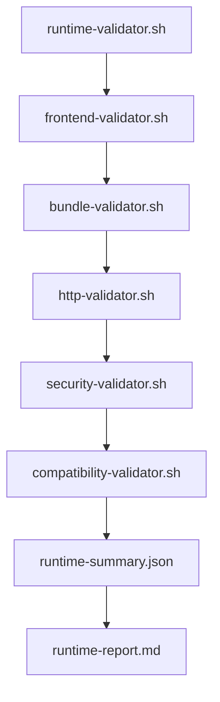

# EPC-W5-03D-R4 - Enterprise Runtime Validation Framework

## 1. Resumo Executivo

Esta fase implementa o primeiro Runtime Validation Framework oficial do FINQZ PRO Enterprise em modo somente leitura. O objetivo e validar o bundle frontend, o manifest, a estrutura do artefato, a superficie HTTP, sinais de seguranca e a compatibilidade do runtime local sem executar deploy, rollback ou qualquer alteracao de ambiente.

O framework foi construído reutilizando ativos ja existentes do repositorio, principalmente:

- `backend/src/core/http/fastify.ts` para entender a superficie oficial de `health` e `ready`;
- `scripts/arch-check.mjs` para a governanca de bundle;
- `scripts/sdc-3.4h-f-local-readiness.mjs` para o padrao de readiness local;
- `release/schemas/manifest.schema.json` e a trilha de release da fase R3.

## 2. Relatorio de Discovery

### 2.1 O que ja existia

- Health checks oficiais em `backend/src/core/http/fastify.ts`:
  - `GET /health`
  - `GET /live`
  - `GET /ready`
- Verificacao de bundle/governance em `scripts/arch-check.mjs`.
- Snapshot local de readiness em `scripts/sdc-3.4h-f-local-readiness.mjs`.
- Manifest e artefatos oficiais de release em `release/schemas/manifest.schema.json` e nos scripts da fase R3.
- Documentacao operacional de release em `docs/06-release/EPC-W5-03D-ENTERPRISE-RELEASE-PIPELINE.md`.

### 2.2 O que nao existia

- Nenhum framework unificado para validar:
  - frontend;
  - bundle;
  - HTTP;
  - seguranca;
  - compatibilidade;
  - consolidacao de evidencias runtime.

### 2.3 Decisao de reaproveitamento

- Reaproveitar o contrato de health/readiness ja exposto pelo backend.
- Reaproveitar a governanca de bundle existente como referencia arquitetural.
- Reaproveitar o schema de manifest ja instituido na fase R3.
- Nao criar arquitetura paralela.

## 3. Arquitetura Final

### Scripts criados

- `scripts/runtime/runtime-validator.sh`
- `scripts/runtime/frontend-validator.sh`
- `scripts/runtime/bundle-validator.sh`
- `scripts/runtime/http-validator.sh`
- `scripts/runtime/security-validator.sh`
- `scripts/runtime/compatibility-validator.sh`

### Responsabilidades

#### runtime-validator.sh

- orquestra todos os validadores;
- consolida evidencias;
- gera `runtime-summary.json`;
- gera `runtime-report.md`;
- nao altera o ambiente.

#### frontend-validator.sh

- valida `dist/`;
- valida `index.html`;
- valida `VERSION`;
- valida `manifest.json`;
- valida `build-info.json`;
- valida `release-notes.md`;
- valida `checksums.sha256`.

#### bundle-validator.sh

- inspeciona o `index.html`;
- rastreia referencias de assets;
- identifica assets ausentes;
- diferencia bundle invalido de asset inexistente.

#### http-validator.sh

- executa `GET /`;
- executa `GET /health`;
- executa `GET /ready`;
- registra `WARNING` quando health/ready nao estiverem expostos.

#### security-validator.sh

- procura `localhost` e `127.0.0.1`;
- procura URLs de dev;
- procura flags de desenvolvimento indevidas;
- procura secrets, API keys, passwords, tokens e Bearer hardcoded;
- procura sinais de JavaScript suspeito no bundle, como `console.error`, `eval` e `debugger`.

#### compatibility-validator.sh

- valida sistema operacional;
- valida arquitetura;
- valida espaco em disco;
- valida permissoes;
- valida Node minimo quando disponivel;
- valida Docker quando disponivel;
- valida Nginx quando disponivel;
- valida a estrutura local esperada sem quebrar quando um componente estiver ausente.

## 4. Fluxo

1. Receber o artefato.
2. Validar frontend e manifest.
3. Validar bundle e assets.
4. Validar HTTP.
5. Validar seguranca.
6. Validar compatibilidade.
7. Consolidar evidencias.
8. Encerrar sem deploy.

## 5. Fluxograma Mermaid

## 6. Evidencias Geradas

- `runtime-summary.json`
- `runtime-report.md`
- `frontend-validation.json`
- `bundle-validation.json`
- `http-validation.json`
- `security-validation.json`
- `compatibility-validation.json`

## 7. Testes Executados

Testes planejados para esta fase:

- `bash -n` nos scripts runtime;
- `shellcheck` quando disponivel;
- bundle valido;
- bundle invalido;
- manifest ausente;
- index inexistente;
- asset inexistente;
- health indisponivel;
- ready indisponivel;
- flags DEV;
- URLs localhost.

## 8. Riscos Identificados

- o bundle pode variar de forma natural a cada build e exigir nova validacao de referencias;
- o ambiente local pode nao expor `health`/`ready`, gerando apenas warning;
- a ausencia de Docker ou Nginx em desenvolvimento local nao bloqueia o framework, mas reduz a amplitude da evidencia.

## 9. Pendencias

- integrar o framework ao gate formal de publicacao;
- conectar o runtime summary a um pipeline futuro;
- refinar a politica de severidade de seguranca para ambientes HML e producao;
- estender o roadmap para validação de runtime remoto quando a fase seguinte permitir.

## 10. Recomendacoes para EPC-W5-03D-R5

1. Transformar o runtime validation framework em gate oficial de publicacao.
2. Adicionar um passo de assinatura/aceite para os JSONs consolidados.
3. Conectar a validacao a um ambiente controlado antes de qualquer deploy real.
4. Revisar a cobertura de seguranca para ficar alinhada ao padrao enterprise final.
